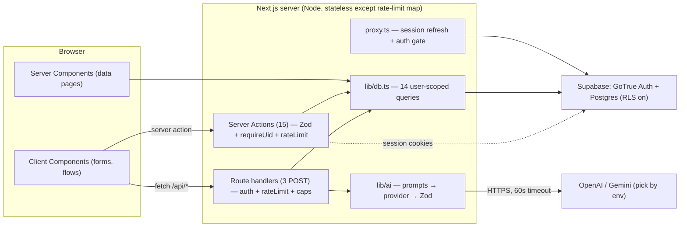
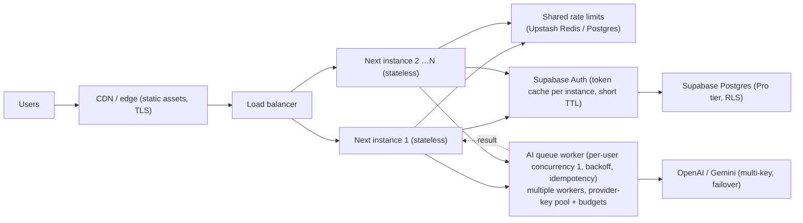

# Technical Handover — AI Pantry & Recipe Assistant ("Pantry")

**Assessment date:** 2026-09-23 · **Method:** fresh static inspection of the current working tree + non-destructive verification commands (recorded in §19/§28). No source files were modified by this assessment. No secret values are reproduced anywhere in this document.

**Repository:** `C:\Users\Karan kaushal\Downloads\AI Pantry and Recipe Assistant` (git remote `https://github.com/Karan7505/AI-Pantry-and-Recipe-Assistant`, 2 commits). Runtime inspected on Windows, Node **v20.12.0**, npm 10.5.0.

**Important state caveat (verified via `git status`):** the repository's *committed* history (2 commits) predates a security-remediation pass. The working tree currently contains **~24 modified files + 6 untracked files (hardening, rate limiter, `proxy.ts`, migration 0002, 2 test suites) that are NOT yet committed**. Everything in this document describes the **current working tree** (what you get by checking out this folder), not what is on GitHub. If someone clones the remote, they get the *pre-hardening* code.

### Status legend used throughout

| Tag | Meaning |
|---|---|
| **VERIFIED** | Executed/observed during this assessment (command output in §19/§28) |
| **IMPL, NOT RUNTIME-VERIFIED** | Code exists and compiles/passes tests, but was not executed against a live service |
| **MOCK/FALLBACK** | Deterministic fallback path stands in for an external service |
| **PARTIAL** | Only part of the claimed behavior is implemented |
| **CONFIG+CREDS** | Implementation complete; needs external credentials/DB to function |
| **STUB/DEAD** | Defined/tested but not wired into any user flow (dead code) |
| **NOT IMPL** | Absent from the codebase |
| **UNKNOWN** | Cannot be determined from the repository |

---

## 1. Executive Summary

**What it is.** Pantry is a single-user-per-account, full-stack web app: photograph your fridge/pantry → a vision LLM detects the ingredients → you confirm/edit them → they persist in a per-user "pantry" (deduplicated by normalized name) → the app generates recipes that *prioritize what you already own*, scores each recipe by pantry-match percentage, and ranks them → one click builds a grocery list from the missing ingredients (unit-aware merge) → saved recipes show a per-serving nutrition estimate with a chart.

**Problem solved.** "What can I cook with what I have, and what do I still need to buy?" — the classic reduce-food-waste / meal-planning loop, with AI doing the recognition and generation.

**Intended users.** Individual consumers (home cooks), one account each. There is **no admin role, no multi-tenancy, no billing, no teams** — none of that exists in the code (verified: no admin routes, no role/permission model beyond "authenticated user").

**Maturity.** This is a **high-quality MVP**: complete user flows end to end, strict typing, 60 passing offline unit tests, a production build that compiles, and a post-audit hardening pass (in the working tree). It is **not a production system**: no CI/CD, no containers, no observability, no integration/E2E tests, no load testing, live integrations not runtime-verified in this assessment, one real functional bug in the grocery-list write path (§30, KI-1), and the entire security hardening is uncommitted. Evidence-based classification: **MVP / pre-production prototype**.

**What works (verified by build + unit tests):** normalization/dedupe math, unit-aware merging, match scoring & ranking, Zod validation of all AI output, tolerant JSON extraction, rate limiter logic, open-redirect sanitization, auth actions, page/route rendering (compiles, static analysis clean).

**What is incomplete / broken:** grocery list "add" duplicates existing rows (§30 KI-1); pantry rescan *overwrites* quantities instead of accumulating (KI-2); `/api/nutrition` has no UI caller; `normalizeIngredients` and `isSupabaseConfigured` are dead code; `MAX_IMAGE_MB` env var is documented but not read; screenshots in README are placeholders; no CI.

**What requires external services/credentials:** a Supabase project (Auth + Postgres + RLS; migrations applied manually in the SQL Editor) and at least one AI provider key (OpenAI **or** Google Gemini). A local `.env.local` **exists** in this working folder (verified present, 594 bytes, gitignored) — i.e. this machine is *configured*, but live end-to-end behavior with real keys/DB was **not** exercised in this assessment.

**Most important technical characteristics:**
- Next.js **16.3.5** App Router (Server Components + Server Actions + proxy), TypeScript strict, Tailwind.
- Supabase (Postgres + RLS + email/password auth via `@supabase/ssr` cookie sessions). **No service-role key anywhere in the app** — all DB access is user-scoped by `auth.uid()` + query-level `user_id` filters (two walls).
- Provider-agnostic AI layer (`lib/ai/`): raw `fetch` to OpenAI or Gemini, 60 s timeout, typed `AiError`s, **every model response validated with Zod before use**.
- Deterministic domain logic (normalization, merge, scoring, ranking) is pure, framework-free, and unit-tested — AI is never in the path for correctness-critical math.

**Most important limitations:**
- All paid-AI calls are synchronous HTTP inside the request (60 s `maxDuration`) — no queue, no background job, no retries.
- Rate limiting is **in-process memory** — does not scale horizontally as-is.
- Single Node process per instance; the app is stateless *except* the in-memory rate-limit map.
- Node 20.19+/22 required by Next 16; this machine runs 20.12 (works, with an EBADENGINE warning).

---

## 2. Product / Functional Overview

Auth: email/password via Supabase Auth. No social login, no password-reset UI in-app (Supabase email flow only), no roles.

| # | Feature | Entry point | Status |
|---|---|---|---|
| 1 | Landing page (marketing) | `/` | VERIFIED (renders; static) |
| 2 | Sign up / Sign in / Sign out | `/signup`, `/login`, settings + nav | IMPL, NOT RUNTIME-VERIFIED (server actions exist; no live run) |
| 3 | Photo scan → AI ingredient detection | `/scan` | CONFIG+CREDS (needs AI key); client+server code VERIFIED by review/tests |
| 4 | Detection confirmation editor (edit/add/remove, low-confidence flags) | `/scan` stage 2 | IMPL (client component; no runtime run) |
| 5 | Pantry CRUD (add/edit/delete/±1 stepper) | `/pantry` | IMPL (actions + DB layer reviewed) |
| 6 | Pantry search + category filter (client-side) | `/pantry` | IMPL (pure client filter) |
| 7 | Expiry tracking + "expiring soon" badge (≤3 days) | `/pantry`, `/dashboard` | IMPL (`daysUntil` util, pure) |
| 8 | Recipe generation with optional filters | `/recipes` | CONFIG+CREDS |
| 9 | Pantry match scoring (% owned) + ranking | `/recipes`, `/recipes/[id]`, `/dashboard` | VERIFIED (unit tests 60/60) |
| 10 | Recipe detail (ingredients have/need, steps, meta) | `/recipes/[id]` | IMPL |
| 11 | Save generated recipe (persist) | "View recipe" button on `/recipes` | IMPL (`saveRecipeAction`) |
| 12 | Nutrition panel (Tremor chart + stat cards, "AI estimate" label) | `/recipes/[id]` | IMPL (renders from saved recipe data) |
| 13 | Per-serving nutrition re-estimate API | `POST /api/nutrition` | **STUB/DEAD as a product feature** — endpoint exists, rate-limited, tested, but **no UI calls it** (verified by grep). Nutrition shown in-app is the estimate generated *during* recipe generation |
| 14 | "Add N missing to grocery list" (never adds owned items) | `/recipes/[id]` | IMPL — **but the persistence path has a duplication bug (KI-1)** |
| 15 | Grocery list: add custom, toggle purchased, delete, clear purchased | `/grocery` | IMPL (toggle/delete correct; add path affected by KI-1) |
| 16 | Dashboard (quick actions, pantry snapshot, expiring soon, recent recipes) | `/dashboard` | IMPL |
| 17 | Settings (account info, AI provider status, sign out) | `/settings` | IMPL |
| 18 | Scan audit trail (`scans` table) | automatic on scan | IMPL — stores AI result JSON only; **images are never persisted** (`image_url` always null — privacy-positive, dead column) |
| 19 | Admin / multi-list grocery / notifications / billing / analytics / search backend / websockets | — | **NOT IMPL** (verified absent) |

### Feature detail (verified against code)

**F3 Scan.** `components/scan-flow.tsx` (client): file picker/drag-drop, accepts `image/jpeg|png|webp`, client-side cap 8 MB/file, max 6 files; files >1.5 MB are downscaled to ≤1024 px JPEG q0.85 via canvas before upload; sends `{images: [dataURLs]}` to `POST /api/pantry/scan`. Server route: auth check → rate limit (`scan`, 10/h) → 28 M-char body cap (413) → Zod `scanInputSchema` (strict MIME regex + 4.5 M-char per-image cap) → `analyzePantryImage` (vision model) → inserts a `scans` audit row → returns merged+confidence-sorted ingredients. **Images are not stored anywhere** (no Supabase Storage usage in code — verified).

**F4 Confirmation.** Editable table: name/qty/unit per row + category `Select` (13 categories, pre-guessed by a regex heuristic `guessCategory`), add-row, remove-row, low-confidence (<0.6) amber badge + banner. Confirm → server action `confirmPantryItems` → Zod re-validation (≤200 items, name ≤120, unit ≤40) → rate limit (30/h) → `mergeIngredients` → `upsertPantryItems` (on-conflict `(user_id, normalized_name)`) → `createScan`. Note: scan-flow calls it **without** `imageUrl` (second arg defaults to null).

**F5–F7 Pantry.** Server action per operation, each re-verifying session (`requireUid`), Zod-validating, DB writes scoped `.eq("user_id", uid)`. Steppers call `adjustPantryQuantity` (clamped ≥0; 0 stored as `NULL` = "some/unknown"). Search and category filter run in the browser over the initially-loaded list (no DB-side search — fine at current scale, see §21).

**F8–F11 Recipes.** `/recipes` loads the pantry names server-side and passes them as props (only for the "N ingredients" caption; the API reloads the pantry itself). Client sends `RecipeFilters` to `POST /api/recipes`; server loads the live pantry, calls `generateRecipes` (LLM, prompted to prioritize owned items), server-side: Zod-validate → strip excluded ingredients (normalized match) → `finalizeRecipe` (availability flags + score) → max-cook-time pre-sort → `rankRecipes`. UI: skeleton loading, error state with retry, empty states, match badge (≥100 herb / ≥75 amber / else tomato). "View recipe" = `saveRecipeAction` (re-validates the whole recipe server-side, 60/h limit) → persists JSONB → navigates to `/recipes/[id]`.

**F12 Nutrition.** Pure rendering of `recipe.nutrition` (already computed at generation time) via `@tremor/react` `BarList` + stat cards; labeled "AI estimate — not medical guidance". The separate `/api/nutrition` endpoint (F13) is not wired to any button.

**F14–F15 Grocery.** `addMissingToGrocery(items, title)`: re-checks the pantry server-side (never adds owned items), merges with current list items in memory, then `upsertGroceryItems`. **Bug KI-1:** that function *inserts* rows (no `onConflict`, and the table has no unique constraint), so every add re-inserts the entire existing list as new rows (duplicating items and reviving "purchased" items as fresh). `toggle`/`delete`/`clear purchased` operate by id + owned-list-id and are correct.

**F16 Dashboard.** `Promise.all` over pantry + last 30 recipes; expiring = `expiration_date` within 3 days; DB errors are swallowed to `[]` (graceful empty state, hides failures — KI-8).

**F18 Audit trail.** `scans(detected_data jsonb)` per scan; `scans.image_url` is always null (KI-6).

**Background/automation:** none — no cron, queues, workers, websockets, or real-time (Supabase realtime is not subscribed to anywhere).


---

## 3. User Journeys / End-to-End Flows

### J1 — Sign up / sign in

```
Browser ──(AuthForm, client)──▶ Server Action signInAction / signUpAction (lib/actions.ts)
   ──▶ supabase.auth.signInWithPassword / signUp  (server client, @supabase/ssr)
   ──▶ Supabase Auth service (GoTrue) ──▶ session JWT pair written to HttpOnly cookie
        (sb-<ref>-auth-token: accessToken + refreshToken, 30-day maxAge, SameSite=Lax,
         Secure in production)
   ──▶ client: router.push(sanitizeNextPath(next)) + router.refresh()
   ──▶ Next re-renders Server Components; proxy.ts also refreshes session on every matched request
```
Email-confirmation mode: `signUp` returns `needsEmailConfirm` when `data.session` is absent; UI shows "check your inbox".

### J2 — Scan → confirm → pantry (the core loop)

```mermaid
sequenceDiagram
  participant U as User (browser)
  participant SF as scan-flow.tsx (client)
  participant API as POST /api/pantry/scan (route)
  participant RL as rateLimit(uid,"scan") in-memory
  participant AI as lib/ai/services.analyzePantryImage
  participant P as OpenAI / Gemini (vision)
  participant DB as Supabase Postgres (RLS)
  U->>SF: picks 1–6 photos
  SF->>SF: validate MIME/size; downscale >1.5MB to ≤1024px JPEG
  SF->>API: { images: [dataURL×≤6] }
  API->>API: auth (cookie session) → 401
  API->>RL: 10/h per user → 429
  API->>API: body ≤28M chars → 413; Zod scanInputSchema → 400
  API->>AI: analyzePantryImage(images)
  AI->>P: chat/completions (gpt-4o) or :generateContent (gemini-1.5-flash), 60s timeout
  P-->>AI: JSON (fenced/bare tolerated by extractJson)
  AI->>AI: Zod pantryDetectionSchema; empty→AiError(empty); mergeIngredients; min-confidence per merged item
  API->>DB: scans.insert (audit row, image_url NULL)
  API-->>U: { ok, data:{ ingredients } }
  U->>SF: ConfirmEditor (edit/add/remove)
  SF->>DB: confirmPantryItems action → Zod ≤200 → rateLimit 30/h → mergeIngredients → pantry_items.upsert (onConflict user_id,normalized_name) + scans.insert
  U->>U: router.push("/pantry")
```
Failure behavior: AI errors map to typed `AiError.userMessage` + 502 `{ok:false,error,code}`; client shows `ErrorState` and returns to upload stage. Non-AI 500s return a generic message; server logs `console.error` (name+message only, no stack to client).

### J3 — Generate recipes → save → detail → grocery

```mermaid
sequenceDiagram
  participant U as User
  participant RG as recipe-generator.tsx
  participant API as POST /api/recipes
  participant DB as Supabase
  participant AI as generateRecipes (text model)
  U->>RG: optional filters (servings/meal/time/cuisine/dietary/excluded)
  RG->>API: RecipeFilters (Zod-capped)
  API->>API: auth → 401; rateLimit "recipes" 30/h → 429
  API->>DB: getUserPantry(uid)  (server loads live pantry)
  API->>AI: prompt(pantry names, prefs) → JSON recipes
  AI->>AI: Zod recipesResultSchema → strip excluded → finalizeRecipe(score, availability) → rankRecipes
  API-->>RG: ranked Recipe[]
  U->>RG: "View recipe" (saves first)
  RG->>DB: saveRecipeAction → Zod persistableRecipeSchema → 60/h → recipes.insert → /recipes/[id]
  Note over DB: /recipes/[id] reads recipes row (uid-scoped, .single()), 404 if not owned
  U->>DB: "Add N missing to grocery list" → addMissingToGrocery → re-check pantry → merge in memory → grocery_items INSERT (⚠ KI-1 duplication)
```

### J4 — Grocery list maintenance
Toggle/delete/clear-purchased are per-item server actions with UUID format checks; list is always the user's default list (fetch-or-create in `getDefaultGroceryList`). Optimistic UI updates followed by `router.refresh()`.

### J5 — Logout
Nav button → `signOutAction` (Supabase signOut clears the cookie) → `router.push("/login")`. Settings page offers a form-action variant `signOutAndRedirect` (redirects server-side).

No other journeys exist: no data export, no onboarding, no notifications, no email templates in-repo (Supabase default emails if configured).

---

## 4. Complete Technology Stack

**Exact versions** from `package.json` / lockfile (VERIFIED):

| Layer | Technology (version) | Why it exists here |
|---|---|---|
| Language | TypeScript 5.5 (strict, `target: ES2017`, `@/*` path alias) | Single language across client/server/DB-layer; strict mode catches the AI-boundary bugs the app is most exposed to |
| Runtime | Node.js — required ≥20.19 by Next 16 (EBADENGINE on local 20.12.0); 22 LTS recommended | Next.js server runtime |
| Framework | **Next.js 16.3.5** (App Router) | RSC for data pages, Server Actions for mutations (cookie auth for free), route handlers for the 3 AI endpoints, `proxy.ts` for session refresh + route protection |
| UI | React 18.3.1 + React DOM 18.3.1 | Next 16 supports 18; team pinned 18.3.1 (no evidence of why 19 wasn't chosen — UNKNOWN) |
| Styling | Tailwind CSS 3.4 + custom palette (cream/herb/tomato/ink, `tailwind.config.ts`) | Design system: warm food-adjacent colors, Inter (sans) + Fraunces (display) via `next/font/google` (self-hosted at build) |
| Charts | `@tremor/react` 3.18.7 | Nutrition macro bar chart + stat cards (only chart in the app) |
| Class utils | clsx 2.x + tailwind-merge 2.x | `cn()` helper (`lib/utils.ts`) |
| DB / Auth | Supabase: Postgres + Row Level Security + GoTrue auth; clients `@supabase/supabase-js` **2.109.0** + `@supabase/ssr` **0.12.0** | Managed Postgres with RLS as the second authorization wall; cookie-session SSR integration; **no ORM** — the PostgREST query builder is the data layer |
| Validation | Zod 3.24 | Every AI response and every API body/server-action input is schema-validated before use |
| AI | **No SDK** — direct typed `fetch` to `api.openai.com/v1/chat/completions` and `generativelanguage.googleapis.com/v1beta/models/{model}:generateContent` | Provider-agnostic layer (`lib/ai/`) with one HTTP abstraction; avoids two SDKs and vendor lock-in |
| Testing | Vitest 3.2.7 (node env, alias `@`) | Offline unit tests of pure logic + mocked AI transport |
| Lint | ESLint 8.57 + `eslint-config-next` 15.5.25 (note: **15.x config on Next 16 — mismatch, see §28**) | `next/core-web-vitals` rules |
| Build | Next's built-in compiler; PostCSS 8.4 + autoprefixer | — |
| Package manager | npm (lockfile present, committed) | — |
| Containers / CI / hosting / observability / queues / cache / search / vector DB / websockets / email SDK / payments / analytics | **NOT IMPL** — none of these exist in the repo (verified: no Dockerfile, no `.github/`, no queue/cache code) | — |

**Outdated/deprecated/conflicting (evident):**
1. `eslint-config-next@^15.5.25` paired with `next@16.3.5` — version skew; works (lint passes) but the 16-series plugin is the correct pair.
2. `middleware` file convention deprecated in Next 16 — **already migrated** to `proxy.ts` in the working tree (VERIFIED: build shows `ƒ Proxy (Middleware)`).
3. Node 20.12.0 local runtime vs Next 16's 20.19+ engine requirement — EBADENGINE warning at install; build/dev still succeed.
4. Dev-only: `vitest@3.2.7` pulls `@vitest/mocker` in a range flagged by npm audit (2 moderate, see §28).
5. `react@18` with Next 16 (React 19-capable) — functional, choice undocumented.
6. Tailwind content glob references a non-existent `./services/**` directory (dead).


---

## 5. Repository Structure

```
AI Pantry and Recipe Assistant/
├── app/                          # Next.js App Router (frontend + backend entry points)
│   ├── layout.tsx                #   root layout: Google fonts (Inter/Fraunces), metadata, globals.css
│   ├── page.tsx                  #   landing page (public, static)
│   ├── not-found.tsx             #   404
│   ├── globals.css               #   Tailwind layers + `focus-ring` utility
│   ├── login/page.tsx            #   force-dynamic; <Suspense><AuthForm mode="login"/></Suspense>
│   ├── signup/page.tsx           #   same, mode="signup"
│   ├── (app)/                    #   PROTECTED route group
│   │   ├── layout.tsx            #   gate: getCurrentUser() or redirect("/login"); wraps <Shell>
│   │   ├── dashboard/page.tsx    #   RSC: pantry + last 30 recipes (Promise.all)
│   │   ├── pantry/page.tsx       #   RSC loads items → <PantryManager initialItems>
│   │   ├── scan/page.tsx         #   → <ScanFlow/>
│   │   ├── recipes/page.tsx      #   RSC loads pantry names → <RecipeGenerator pantry>
│   │   ├── recipes/[id]/page.tsx #   RSC, async params; getRecipe(uid,id) or notFound()
│   │   ├── grocery/page.tsx      #   RSC loads default list + items → <GroceryManager>
│   │   └── settings/page.tsx     #   account card, AI-provider status, sign-out form
│   └── api/                      #   REST surface (the ONLY way the browser reaches AI)
│       ├── pantry/scan/route.ts  #   POST: vision detection
│       ├── recipes/route.ts      #   POST: recipe generation
│       └── nutrition/route.ts    #   POST: nutrition re-estimate (orphan — no UI caller)
├── lib/
│   ├── types.ts                  #   ALL shared domain types (Category×13, rows, Recipe, Nutrition)
│   ├── config.ts                 #   AI provider resolution (env → ProviderConfig | AiError config)
│   ├── ingredients.ts            #   PURE: normalize/singularize/synonyms, units, mergeIngredients
│   ├── match.ts                  #   PURE: scoreRecipe, finalizeRecipe, rankRecipes, matchLabel
│   ├── auth.ts                   #   getCurrentUser / requireUid / publicError (error mapping)
│   ├── actions.ts                #   "use server" — auth actions (4)
│   ├── actions-data.ts           #   "use server" — data actions (11), Zod re-validation + rate limits
│   ├── db.ts                     #   ALL Postgres access (14 fns), uid-scoped, dbError() hygiene
│   ├── ratelimit.ts              #   in-memory fixed-window limiter (RULES + injectable clock)
│   ├── utils.ts                  #   cn(), sanitizeNextPath, format*, daysUntil, isSupabaseConfigured(dead)
│   ├── supabase/server.ts        #   server client (async cookies(), hardened cookieOptions)
│   ├── supabase/client.ts        #   browser client (cookie-backed)
│   └── ai/
│       ├── errors.ts             #   AiError class, 8 codes, canned userMessage
│       ├── schemas.ts            #   Zod: AI output contracts + API input contracts (caps)
│       ├── prompts.ts            #   5 prompt builders (system/user)
│       ├── provider.ts           #   callStructured: OpenAI|Gemini HTTP, 60s timeout, extractJson
│       └── services.ts           #   4 public services (analyze/generateRecipes/generateNutrition/normalize)
├── components/
│   ├── ui.tsx                    #   design primitives: Button, Card, Badge, Field, Input, Select, Textarea, Spinner, Skeleton, EmptyState, ErrorState
│   ├── shell.tsx                 #   sticky header nav (desktop + mobile menu), sign-out
│   ├── auth-form.tsx             #   login/signup form (client)
│   ├── scan-flow.tsx             #   upload → working → confirm stages; canvas downscale; guessCategory
│   ├── pantry-manager.tsx        #   CRUD UI, search/filter, modals, steppers
│   ├── recipe-generator.tsx      #   filters, fetch /api/recipes, skeletons, cards, save
│   ├── nutrition-panel.tsx       #   Tremor BarList + stat cards
│   ├── add-to-grocery.tsx        #   "Add missing" CTA
│   └── grocery-manager.tsx       #   list UI, optimistic toggles
├── supabase/migrations/
│   ├── 0001_init.sql             #   5 tables, indexes, updated_at trigger, RLS + policies
│   └── 0002_grocery_items_update_policy.sql  #   adds `with check` to the grocery UPDATE policy
├── tests/                        #   6 Vitest suites, 60 tests, fully offline
├── proxy.ts                      #   session refresh + route protection (Next 16 proxy convention)
├── SECURITY_AUDIT.md             #   2026-09-21 audit (1C/4H/7M/7L) + appended REMEDIATION LOG
├── README.md                     #   440-line product/developer doc
├── package.json / package-lock.json / tsconfig.json / next.config.mjs
├── tailwind.config.ts / postcss.config.js / vitest.config.ts / .eslintrc.json
├── .env.example                  #   documented env template (placeholders only)
└── .env.local                    #   REAL local credentials (gitignored; exists in this folder — do not commit/share)
```

**Relationships.** `app/` pages never touch Supabase or AI directly: RSC pages read through `lib/db.ts`; mutations go through `lib/actions*.ts`; AI goes through `app/api/*` → `lib/ai/services` → `lib/ai/provider`. `lib/ingredients.ts` + `lib/match.ts` are leaf modules with zero imports from the rest of `lib` (except types) — that's what makes them unit-testable without mocks.

---

## 6. System Architecture



**Design rationale (evidence-based):**
- *Two authorization walls* (query-level `user_id` scoping **and** RLS) — explicitly written in `lib/db.ts` header comment as defense-in-depth after audit H-4.
- *AI isolated behind 4 typed service functions* so that prompt/HTTP/JSON-parsing changes never leak into UI; Zod is the trust boundary ("never trust raw AI output" — `lib/ai/schemas.ts` header).
- *Deterministic core* (merge/score/rank) kept pure on purpose: the expensive, unreliable component (the LLM) only *proposes* data; correctness-critical math runs locally and is tested.
- *No service-role key* (README + `.env.example` state this is intentional): the app never needs to bypass RLS, so the blast radius of a server compromise is bounded to one user's rows.
- *Images never stored*: only the AI's JSON result is persisted (`scans`), so user photos live only in memory for one request.
- *REST routes for AI, actions for data*: server-action payloads are capped by Next (1 MB default), so multi-MB base64 images must go through route handlers — an evident consequence of the API split.

**Trust boundaries:** browser (untrusted) → Next server (trusted: validates, scopes, calls out) → Supabase (trusted infra; RLS re-checks auth.uid()) / LLM (untrusted *content*, typed *envelope*). Cookies carry the only credential in the browser; it's HttpOnly so JS can't read it.

---

## 7. Frontend Architecture

- **Routing:** 3 public pages (`/`, `/login`, `/signup`) + 7 protected pages under the `(app)` group. All data pages are `force-dynamic` RSCs; landing is static.
- **Client/server split:** every page is a thin RSC that (a) verifies the session, (b) reads initial data via `lib/db.ts`, (c) renders one stateful client component. Client state is local React `useState` only — **no external state library** (no Redux/Context store/Zustand); `router.refresh()` after each mutation re-fetches server data. This keeps the client simple but means stale-UI risk between refresh (e.g., two tabs).
- **Auth state:** never read client-side. `@supabase/ssr` browser client exists (`lib/supabase/client.ts`) but is not imported by any component (verified by grep — the session cookie is HttpOnly and only the server reads it). Auth state flows as: server renders protected/unprotected; client just calls actions.
- **API communication:** 3 `fetch` POSTs (`/api/pantry/scan`, `/api/recipes`) with JSON; 15 server actions imported directly (no fetch for actions). Errors surfaced via `ErrorState`/inline `role="alert"` banners using server-provided user-safe strings.
- **Forms:** controlled inputs; client-side checks are advisory (MIME, size, password length ≥8, confirm-match); **all** enforcement re-happens server-side (Zod in actions/routes).
- **Validation:** Zod on the server only; no client validation library.
- **Loading/empty/error:** `Skeleton` (recipe grid, 4 cards), spinners (`working` stage, button `loading`), `EmptyState` (pantry/grocery/recipes/no-matches), `ErrorState` (scan failure w/ retry, recipe failure w/ retry).
- **Realtime:** none.
- **Notable UI details:** pantry search/category filter is client-side over the initial page load; modals are custom (Escape-to-close); mobile nav via hamburger; Tremor `BarList` for macros; design tokens (cream/herb/tomato/ink) in Tailwind config; accessibility: `aria-label`s on icon buttons, `role="alert"`, `focus-ring` utility.

**Path of a request:** e.g. grocery toggle → `GroceryManager.toggle` → optimistic `setItems` → `toggleGroceryItem(id, completed)` (server action, HTTP POST by Next) → `requireUid()` → UUID check → `getDefaultGroceryList(uid)` → `setGroceryItemComplete(listId,id,completed)` (`.eq(id).eq(grocery_list_id)`) → `revalidatePath("/grocery")` → `router.refresh()` → RSC re-renders with fresh rows.

---

## 8. Backend Architecture

**Entry points:** (a) RSC page renders, (b) 15 server actions (`lib/actions.ts` ×4, `lib/actions-data.ts` ×11), (c) 3 route handlers, (d) `proxy.ts` (runs before matched routes: refreshes Supabase session token, redirects unauthenticated → `/login?next=<path>`, redirects authenticated users away from `/login`|`/signup` to `/dashboard`; matcher excludes static assets).

**Layers & responsibility boundaries:**

| Layer | File(s) | Allowed to do | Must not do |
|---|---|---|---|
| Routes | `app/api/*/route.ts` | auth check, rate limit, body caps, Zod, call one service, map errors | touch DB directly (only scan writes an audit row via `createScan`) |
| Actions | `lib/actions*.ts` | `requireUid`, Zod, rate limit, orchestrate db fns, `revalidatePath` | call AI (data actions never do; recipe *generation* is a route) |
| Data | `lib/db.ts` | user-scoped PostgREST queries, `dbError()` | accept un-scoped ids, return raw errors |
| Domain | `lib/ingredients.ts`, `lib/match.ts` | pure functions | I/O |
| AI | `lib/ai/*` | provider HTTP, Zod, typed errors | persist, auth logic |
| Auth | `lib/auth.ts`, `lib/supabase/*` | session read/write, error mapping | business logic |

**Error handling:** three distinct patterns — routes return JSON `{ok,error,code?}` with status 401/400/413/429/502(AiError)/500; actions throw `Error` with a short user-safe message (surfaced by the calling component — note: components `await` actions without try/catch in several places, so thrown messages appear via React's error boundary/console; see KI-9); DB errors are logged server-side (`[db:<fn>] message`) and re-thrown as a fixed user string.

**Logging:** `console.error` with `[tag]` prefixes only (`[scan]`, `[recipes]`, `[nutrition]`, `[db:*]`, `[auth]`, `[scan:record]`). No structured logging, no request ids, no metrics (§24).

**Authorization model:** single implicit role ("authenticated"). Every action starts with `requireUid()`; every db fn takes `userId` (or a list id obtained via `getDefaultGroceryList(uid)`) and appends `.eq(user_id, …)` / parent-list scoping; RLS policies are the second wall. **There are no admin endpoints, no service role, no privileged path** (verified by grep for `service_role`, `serviceRole`, admin routes — none).


---

## 9. API Inventory

### 9.1 REST endpoints (the only HTTP surface)

| Method + Route | File | Purpose | Auth | Rate limit | Input (Zod) | Output | Side effects / external | Errors |
|---|---|---|---|---|---|---|---|---|
| `POST /api/pantry/scan` | `app/api/pantry/scan/route.ts` | Vision detection of 1–6 photos | cookie session → 401 | `scan` 10/h → 429 | `scanInputSchema`: `images` 1–6 strings, each a strict `data:image/(jpeg\|png\|webp);base64,…` ≤4.5 M chars; raw body ≤28 M chars → 413 pre-parse | `{ok:true,data:{ingredients:[{name,quantity,unit,confidence}]}}` or `{ok:false,error,code?}` | **OpenAI/Gemini** vision call (60 s); inserts `scans` row | 400 bad body/MIME/size · 401 · 413 · 429 · 502 `AiError.userMessage`+code · 500 generic |
| `POST /api/recipes` | `app/api/recipes/route.ts` | Generate ≤8 recipes against the user's live pantry | 401 | `recipes` 30/h → 429 | `recipeFiltersSchema`: `servings` 1–24?, `mealType` enum?, `maxCookTimeMinutes` 5–720?, `cuisine` ≤60?, `dietary` ≤80?, `excluded` ≤30×≤60, `count` 1–8? (all optional) | `{ok:true,data:{recipes: Recipe[]}}` ranked | loads `pantry_items`; **text** LLM call | 400/401/429/502/500 as above |
| `POST /api/nutrition` | `app/api/nutrition/route.ts` | Re-estimate per-serving nutrition for an arbitrary recipe | 401 | `nutrition` 60/h → 429 | `{title ≤140, ingredients: 1–40 strings ≤120}` | `{ok:true,data: Nutrition}` | **text** LLM call | 400/401/429/502/500 |

All three: `runtime="nodejs"`, `dynamic="force-dynamic"`, `maxDuration=60`. No GET endpoints, no WebSocket/SSE, no file-download endpoints. **No UI caller exists for `/api/nutrition`** (grep-verified) — it is a working but orphan endpoint.

### 9.2 Server actions (invoked by Next as HTTP POSTs with action ids)

| Action (file `lib/actions.ts` / `lib/actions-data.ts`) | Purpose | Auth | Validation | Rate limit | DB write(s) |
|---|---|---|---|---|---|
| `signInAction(email,pw)` / `signUpAction` | auth | — | Supabase-side; pw ≥8 enforced client-only (server relies on Supabase project settings) | Supabase auth limits | session cookie |
| `signOutAction` / `signOutAndRedirect` | logout | — | — | — | cookie cleared |
| `addPantryItem(input)` | create | `requireUid` | `pantryInputSchema` (name 1–120, qty 0<q≤1e6, unit ≤40, category enum, date ≤20) | — | `pantry_items` upsert |
| `updatePantryAction(id, patch)` | update | `requireUid` | partial schema; re-reads user's list first (name fallback) | — | `pantry_items` update (uid-scoped, allow-listed cols) |
| `adjustPantryQuantity(id, Δ)` | ±1 stepper | `requireUid` | — | — | update (0→NULL) |
| `deletePantryAction(id)` | delete | `requireUid` | — | — | delete (uid-scoped) |
| `confirmPantryItems(items[, url])` | scan confirm | `requireUid` | array 1–200 items, per-item caps | `pantry-confirm` 30/h | `pantry_items` upsert (merged) + `scans` insert |
| `saveRecipeAction(recipe)` | persist recipe | `requireUid` | `persistableRecipeSchema` (full re-validation of every field, tight caps) | `save-recipe` 60/h | `recipes` insert |
| `addMissingToGrocery(items, title)` | recipe→grocery | `requireUid` | 1–100 items capped; **server re-filters owned items** | `grocery-add` 60/h | `grocery_items` **insert** (⚠ KI-1) |
| `addCustomGroceryItem(input)` | manual add | `requireUid` | single item caps | `grocery-add` 60/h | `grocery_items` insert (⚠ KI-1) |
| `toggleGroceryItem(id, completed)` | check off | `requireUid` | UUID regex | — | update (list-scoped) |
| `removeGroceryItem(id)` | delete line | `requireUid` | UUID regex | — | delete (list-scoped) |
| `clearPurchasedGrocery()` | bulk clear | `requireUid` | — | — | delete where completed |

`revalidatePath` is called after each mutation so the next RSC render is fresh.

---

## 10. Database & Data Model

**Engine:** PostgreSQL on Supabase. **Access:** PostgREST via `supabase-js`, always through `lib/db.ts`. **Migrations:** applied **manually** (SQL Editor) — no migration runner, no `supabase link`, no `supabase db push` config in repo. Two files: `0001_init.sql` (schema) and `0002_grocery_items_update_policy.sql` (policy fix). Note: `0001` in the working tree already contains the corrected `with check` clause (3 lines added post-audit), so fresh installs get both fixes from 0001 alone; **existing databases still need 0002**.

```mermaid
erDiagram
  auth_users ||--o{ pantry_items : "user_id (cascade)"
  auth_users ||--o{ scans : "user_id (cascade)"
  auth_users ||--o{ recipes : "user_id (cascade)"
  auth_users ||--o{ grocery_lists : "user_id (cascade)"
  grocery_lists ||--o{ grocery_items : "grocery_list_id (cascade)"

  pantry_items {
    uuid id PK
    uuid user_id FK
    text name
    text normalized_name
    numeric quantity
    text unit
    text category
    date expiration_date
    timestamptz created_at
    timestamptz updated_at "trigger"
  }
  scans { uuid id PK; uuid user_id FK; text image_url "always NULL (dead col)"; jsonb detected_data; timestamptz created_at }
  recipes { uuid id PK; uuid user_id FK; text title; text description; jsonb recipe_data "full Recipe"; timestamptz created_at }
  grocery_lists { uuid id PK; uuid user_id FK; text name "default 'My grocery list'"; timestamptz created_at; timestamptz updated_at "trigger" }
  grocery_items { uuid id PK; uuid grocery_list_id FK; text name; text normalized_name; numeric quantity; text unit; boolean completed; text source_recipe_title; timestamptz created_at }
```

**Constraints & indexes:** `UNIQUE (user_id, normalized_name)` on `pantry_items` (+ covering index `pantry_items_user_norm_idx`) — this is the dedupe engine; `user_id` b-tree indexes on all four direct tables; `grocery_items(grocery_list_id)`. **No unique constraint on `grocery_items (grocery_list_id, normalized_name, unit)`** — the missing piece behind KI-1. FKs `ON DELETE CASCADE` from `auth.users` and from `grocery_lists` — account deletion removes everything (see §18).

**RLS:** enabled on all 5 tables. Policies: `for all using (auth.uid() = user_id) with check (…)` on the four direct tables; `grocery_items` scoped via `exists (grocery_lists l where l.id = grocery_list_id and l.user_id = auth.uid())` for select/insert/update(`with check` in 0002)/delete. RLS is **applied only if the SQL was actually run in the live project** — the repo cannot prove it was (UNKNOWN; §33).

**Entity mapping:** `PantryItem`↔`pantry_items`, `RecipeRow.recipe_data`↔`Recipe` (whole object as JSONB — schema changes to `Recipe` are *not* migration-tracked for old rows; `getRecipe` casts `as Recipe` with no runtime validation — KI-7), `GroceryItemRow`↔`grocery_items`, `ScanRow`↔`scans`, `GroceryListRow`↔`grocery_lists`.

**Retention/deletion:** no TTLs, no archival. Deletion is explicit (item deletes) or cascading (account deletion in Supabase removes all rows). Grocery "clear purchased" is a hard delete of completed rows.

---

## 11. Data Flow & Data Lifecycle

| Data | Origin | Path | Stored where | Third parties | Lifetime | Deletion |
|---|---|---|---|---|---|---|
| **Photos** | user file picker | browser (downscaled in canvas) → base64 in JSON body → route → **LLM API** | **nowhere persistent** (not even in `scans` — `image_url` stays NULL) | OpenAI or Google (images sent inline to the vision API) | memory for one request | N/A (never persisted) |
| **Detected ingredients** | LLM JSON | route → Zod → response → ConfirmEditor → action → upsert | `pantry_items` (+ `scans.detected_data` copy) | none after detection | until user deletes; `updated_at` on change | user delete; cascade on account delete |
| **Pantry (manual)** | user forms | action → Zod → upsert | `pantry_items` | none | same | same |
| **Recipe filters** | user form | client → route → prompt | not persisted (only saved recipes are) | sent to LLM as prompt text | request-scoped | N/A |
| **Recipes** | LLM JSON | route → Zod → finalize → **client holds them in memory** → `saveRecipeAction` (only if user clicks View) | `recipes.recipe_data` JSONB (saved ones only) | none after generation | until account delete | no delete-recipe UI exists (KI-10) |
| **Grocery items** | recipe missing list / manual | action → in-memory merge → insert | `grocery_items` | none | until cleared (purchased = hard delete) | toggle/delete/clear; cascade |
| **Email address + password hash** | signup | Supabase Auth | Supabase `auth.users` (managed) | Supabase (email delivery if confirm enabled) | account lifetime | Supabase account deletion → FK cascade removes all app data |
| **Session JWTs** | Supabase Auth | HttpOnly cookie `sb-<ref>-auth-token` | browser cookie (30 d maxAge) + Supabase refresh store | Supabase | 30 days (cookie), refresh-token lifetime (Supabase-managed) | sign out; proxy refreshes on activity |

**Trust boundaries crossed by each item:** photos cross to the LLM provider (the only user content leaving the Supabase/Next perimeter); everything else stays within browser↔Next↔Supabase. **No analytics, no telemetry, no third-party data sharing** of any kind.

**Sensitive-data notes:** pantry contents are behavioral personal data (food preferences, possibly health hints via dietary filters — sent to the LLM as text). Photos may show more than food (packaging, notes in a fridge) — those pixels go to the AI provider and are not stored by this app. There is no consent screen, no data-export, no account-deletion UI (deletion is only via Supabase account controls — KI-11).

---

## 12. Authentication & Authorization

**Registration:** `POST`-style server action → `supabase.auth.signUp({email,password})`. Client enforces password ≥ 8 chars; the *server* does not re-check length (relies on Supabase project settings — UNKNOWN whether the live project enforces ≥8; §33). Email confirmation: if the project requires it, `data.session` is absent → UI instructs user to confirm. Duplicate email → mapped generic message ("Unable to create the account…") to reduce enumeration.

**Login:** `signInWithPassword`; on success @supabase/ssr writes the session cookie. All errors pass through `publicError()` (regex-mapped to canned messages; raw provider text logged server-side only) — deliberate anti-enumeration.

**Logout:** `supabase.auth.signOut()` clears the cookie; two variants (client-push or form redirect).

**Sessions:** JWT access+refresh in one HttpOnly/Lax/(Secure in prod)/30-day cookie. `proxy.ts` calls `getUser()` on every matched request, triggering automatic refresh (token rotation) before page rendering. Server Components call `getCurrentUser()` per page render (each does a `getUser` round-trip — a known Supabase SSR cost pattern, see §21).

**Password storage:** bcrypt/argon2 **inside Supabase** — the app never sees or stores passwords. No password-reset page in the app; depends on Supabase's email reset if enabled in the dashboard (UNKNOWN live setting).

**Route protection (three layers):** (1) `proxy.ts` redirect for non-public paths; (2) `(app)/layout.tsx` re-check + redirect; (3) per-page `getCurrentUser()` guard. API layer: (4) `getCurrentUser()` 401 in each route; (5) `requireUid()` in every action; (6) db-level uid scoping; (7) RLS.

**Authorization model / roles:** none beyond "authenticated user owns their rows". No admin, no roles table, no permissions. **IDOR posture:** all id-based mutations scoped by `user_id` or owned-list id in the query itself (KI-1's grocery *insert* path doesn't take a user id but the target list is always the caller's default list — safe). `getRecipe(uid, id)` treats "not found" (incl. other-user id) as 404 — no existence leak.

**CSRF:** SameSite=Lax + no cross-site reads of data (all mutations are POST actions/routes) → standard modern mitigation; no CSRF tokens (none needed under these conditions).

**Identified gaps:** (a) no server-side password strength re-check; (b) session cookie `Secure` only in `NODE_ENV=production` — a non-HTTPS prod-like env would ship plaintext tokens; (c) no account-deletion/2FA features (Supabase-side capabilities unused); (d) RLS enforcement in the *live* DB is not verifiable from the repo (manual checklist item).


---

## 13. Third-Party Services & External Dependencies

| Service | Purpose | Integration (files) | Env vars | Data sent | Expected response | Failure behavior | Status | Cost/rate notes |
|---|---|---|---|---|---|---|---|---|
| **Supabase** (one project) | Auth (GoTrue) + Postgres + RLS + (optional) auth emails | `lib/supabase/{server,client}.ts`, `proxy.ts`, `lib/auth.ts`, `lib/actions.ts`, `lib/db.ts`, migrations | `NEXT_PUBLIC_SUPABASE_URL`, `NEXT_PUBLIC_SUPABASE_ANON_KEY` (public, client-visible) | email+password (auth), all app rows, session refresh calls | PostgREST JSON, JWTs | `dbError()` → fixed user message; auth → mapped canned message | **CONFIG+CREDS** — `.env.local` present in this folder (verified by file existence only); migrations must be manually applied; **live behavior not runtime-verified in this assessment** | Free tier works; DB scale limits per plan |
| **OpenAI** (optional provider) | vision detection + recipe/nutrition generation | `lib/ai/provider.ts` (`callOpenAI`), `lib/config.ts` | `OPENAI_API_KEY`; optional `OPENAI_VISION_MODEL` (default `gpt-4o`), `OPENAI_TEXT_MODEL` (default `gpt-4o`) | system+user prompts; pantry item names; base64 images (scan only) | JSON chat completion | HTTP 401/403→`auth`, 429→`rate_limit`, other→`model_error`; 60 s abort→`timeout`; non-JSON→`invalid_response`; all → canned UI message + 502 | **READY FOR LIVE CREDENTIALS** (fully implemented, tested with mocked transport; no live call executed here) | paid per token; vision is the expensive path (≤10 scans/h/user by limiter) |
| **Google Gemini** (optional provider) | same as OpenAI | `lib/ai/provider.ts` (`callGemini`) | `GOOGLE_GENERATIVE_AI_API_KEY`; optional `GEMINI_VISION_MODEL`/`GEMINI_TEXT_MODEL` (default `gemini-1.5-flash`) | same as above (key in `x-goog-api-key` **header**, never URL — post-audit fix) | `:generateContent` JSON | same mapping | **READY FOR LIVE CREDENTIALS** (same caveats) | paid per token/char |
| **Google Fonts** (build-time only) | Inter + Fraunces via `next/font/google` | `app/layout.tsx` | — | font family requests | font files (self-hosted into build output) | build fails without network | **VERIFIED** (build succeeded with fonts embedded) | free |
| Everything else (email delivery, image CDN, analytics, payments…) | — | — | — | — | — | — | **NOT IMPL** (email = only what Supabase project config does) | — |

**Provider selection** (`lib/config.ts`): precedence = `force` arg (unused at runtime) > `VISION_PROVIDER` env > first available key (OpenAI preferred). If none → `AiError(config)` → 502 with "check your .env" message. Both providers can coexist; the switch is a single env var (no code change).

---

## 14. Environment & Configuration

Source of truth: `.env.example` (template, placeholders) and code reads (`process.env.…`). `.env.local` exists in this working folder (594 B, gitignored) — values redacted/never shown.

| Variable | Purpose | Required? | Environment | Sensitive? | Used where |
|---|---|---|---|---|---|
| `NEXT_PUBLIC_SUPABASE_URL` | Supabase project URL | **yes** | client+server | no | `lib/supabase/*`, `proxy.ts` |
| `NEXT_PUBLIC_SUPABASE_ANON_KEY` | public anon key (RLS is the wall) | **yes** | client+server | semi-public | same |
| `OPENAI_API_KEY` | OpenAI provider | one of the two AI keys | server only | **yes** | `lib/config.ts` → `provider.ts` |
| `GOOGLE_GENERATIVE_AI_API_KEY` | Gemini provider | one of the two AI keys | server only | **yes** | same |
| `VISION_PROVIDER` | force `openai`\|`gemini` when both keys exist | no | server only | no | `lib/config.ts` |
| `OPENAI_VISION_MODEL` / `OPENAI_TEXT_MODEL` | model overrides (defaults `gpt-4o`) | no | server only | no | `lib/config.ts` |
| `GEMINI_VISION_MODEL` / `GEMINI_TEXT_MODEL` | model overrides (defaults `gemini-1.5-flash`) | no | server only | no | `lib/config.ts` |
| `MAX_IMAGE_MB` | documented as "client-side max file size" | no | client | no | **NOT READ BY ANY CODE** — `scan-flow.tsx` hardcodes `MAX_MB = 8` (KI-4) |
| `NODE_ENV` | toggles `Secure` cookie flag | (implicit) | server | no | `lib/supabase/server.ts` |

**No service-role key** exists in `.env.example` or any code (verified by grep) — deliberate. **No feature flags** beyond provider selection. **No mock/live switch in code** — the only "mock" is the deterministic fallback in `normalizeIngredients` (itself dead code, KI-5) and `vi.mock` in tests. Config precedence for provider: force > env > key order. Defaults: models as above; limits are code constants (§16), not env.

**Dev vs prod:** identical code path; prod differs only by `Secure` cookie + whatever the host sets (`maxDuration` hints at serverless/Vercel-style runtime but nothing host-specific is configured in-repo).

---

## 15. Mock / Fallback / Live Mode Analysis

| Integration / behavior | Classification | Evidence |
|---|---|---|
| Supabase auth + DB | **CONFIG+CREDS** (READY FOR LIVE CREDENTIALS) | full client code; `.env.local` present; no live session/DB operation executed in this assessment; migrations manual |
| OpenAI vision/text | **READY FOR LIVE CREDENTIALS** | `callOpenAI` complete (endpoint, auth header, JSON mode, error mapping, timeout); unit-tested with mocked transport only; no live call here |
| Gemini vision/text | **READY FOR LIVE CREDENTIALS** | `callGemini` complete (v1beta `:generateContent`, `responseMimeType`, header key); same testing caveat |
| `normalizeIngredients` (AI-assisted canonicalization) | **MOCK/FALLBACK — and dead code** | `services.ts:155` has try/AI-catch/deterministic-fallback, **but no app code calls it** (grep: only tests import it). The live app uses pure `normalizeIngredientName` instead — i.e. the app works fully with AI down for normalization |
| `generateNutrition` / `/api/nutrition` | **PARTIAL** (endpoint live-ready; product feature unwired) | route + service complete and tested; **no UI caller** (grep) |
| `scans.image_url` | **STUB/DEAD column** | both `createScan` call sites pass `null` |
| Recipe `pantryQuantity`/`pantryUnit` fields | **STUB/DEAD fields** | `finalizeRecipe` hardcodes both `null` |
| `isSupabaseConfigured()` | **STUB/DEAD** | defined `lib/utils.ts:9`, zero callers |
| `MAX_IMAGE_MB` env | **PLACEHOLDER** | documented in `.env.example`+README, never read |
| README screenshots | **PLACEHOLDER** | table of suggested filenames, no images; `docs/screenshots/` does not exist |
| Grocery lists plural ("additional lists supported") | **PARTIAL** | schema supports N lists; app only ever creates/uses the default one; no UI for others |
| Multi-recipe grocery sources / source attribution | VERIFIED | `source_recipe_title` stored & displayed ("from X") |
| Seed/demo data | **NOT IMPL** — no seed script, no demo accounts | verified absent |

**Bottom line:** adding real keys + running the two migrations is genuinely sufficient to make every *wired* feature live — there are no hidden stubs behind the working flows. The dead items are optional capabilities, not gates.

---

## 16. Business Logic & Domain Rules

All in `lib/ingredients.ts`, `lib/match.ts`, `lib/ai/*`, `lib/ratelimit.ts` — pure and unit-tested.

**Name normalization** (`normalizeIngredientName`): lowercase → strip punctuation (`[.,/#!$%^&*;:{}= \-`~()"'?]`→space) → collapse spaces → synonym lookup (29-entry `SYNONYMS`: e.g. `eggplant→aubergine`, `courgette(s)→zucchini`, `olive-oil→olive oil`, `sweet potatoes→sweet potato`) → else `singularize` (ies→y; -oes strip; ches/shes/xes/zes/sses strip 2; ss keep; trailing s strip; words ≤3 chars untouched) → synonym lookup on singular → return. This string is the identity key for dedupe everywhere (DB unique, merge, scoring, exclusion filtering).

**Unit canonicalization** (`UNIT_CANON`, ~30 entries): g/kg/mg/ml/l/cup/tsp/tbsp/oz/piece(=count)/slice/whole/clove, singular+plural forms; unknown units fall back to `singularize`. **Compatibility** = both canonicalize equal; `null` is never compatible with anything (so "2 cup + 200 g" never merges; "2 + 3 pieces" → 5).

**Merge** (`mergeIngredients`): bucket by normalized name → within bucket group by compatible unit → per group: sum quantities **only if all known**, else `quantity: null` (unknown poisons the sum); display name = first input; result sorted by display name. Used for: scan-batch dedupe, confirm-to-pantry, grocery add (in-memory pre-insert).

**Scoring** (`scoreRecipe`): `score = round(1000 × owned/total)/10` where owned = ingredient *entries* whose normalized name ∈ pantry normalized names. Quantities deliberately ignored (comment: "not trusted"). ⚠ doc-comment says "distinct" ingredients but code counts list entries (KI-3). Empty recipe → 100.

**Ranking** (`rankRecipes`): `matchScore` desc → missing-count asc → `cookTimeMinutes` asc. Additionally, if `maxCookTimeMinutes` filter is set, recipes ≤ cap are stably pre-sorted to the front (cap-respecting, non-filtering — "prefer, but keep the list full").

**Exclusions** (`generateRecipes`): client's `excluded[]` normalized → set; matching ingredients removed from each recipe *server-side* (belt-and-braces with the prompt instruction); a recipe that loses all ingredients is dropped.

**Servings:** `filters.servings` (1–24) overrides the model's value on finalization.

**Availability:** per-ingredient `available = normalized name in pantry`; `matchLabel`: 0 missing → "You have everything"; else "Missing N ingredient(s)". Badge tones: 100 herb, ≥75 amber, else tomato (UI convention, three places: cards, detail, dashboard).

**Confidence:** detection items carry model confidence 0–1; merged item confidence = **min** of its parts (conservative); <0.6 flagged "uncertain" in UI; sorted desc.

**Qty semantics:** `quantity = null` means "some/unknown" (UI: "some"/"unknown"); pantry stepper clamps ≥0 and stores 0 as NULL.

**Rate limits** (`RULES`, fixed 1-hour windows, in-memory): scan 10, recipes 30, nutrition 60, pantry-confirm 30, save-recipe 60, grocery-add 60 per user. Unknown route keys = unlimited.

**Key constants:** 60 s AI timeout; temperature 0.4 (both providers); 4.5 M chars/image (~3.3 MB binary); 28 M chars body; 6 images; 8 MB client file cap; 1.5 MB downscale threshold → ≤1024 px JPEG q0.85; default recipe count 4 (max 8); dashboard shows last 30 recipes; expiring threshold 3 days.


---

## 17. Security Assessment

Defensive review of the **current working tree** (post-remediation). A prior full audit exists in `SECURITY_AUDIT.md` (2026-09-21: 1 Critical / 4 High / 7 Medium / 7 Low on the *original* code, with an appended REMEDIATION LOG). This section re-verifies the *current* state with fresh evidence.

### 17.1 Controls verified present (current state)

| Control | Evidence | Status |
|---|---|---|
| Session cookie: HttpOnly, SameSite=Lax, 30-day, Secure in prod — identical in server client, proxy, browser client | `lib/supabase/server.ts:11-17`, `proxy.ts`, `lib/supabase/client.ts` | VERIFIED by code |
| Authorization: `requireUid()`/`getCurrentUser()` in every action & route; **query-level** `user_id`/list scoping on all 14 db fns; patch allow-list (`PANTRY_PATCH_COLUMNS`); UUID regex on grocery ids | `lib/actions-data.ts`, `lib/db.ts` | VERIFIED by code |
| RLS on all 5 tables incl. `with check` on grocery UPDATE (0002) | `supabase/migrations/0001_init.sql:87-126`, `0002…sql` | VERIFIED in files; **live-DB application UNKNOWN** |
| Input validation: Zod on all 3 API bodies + all 11 data actions (caps §16); strict image MIME regex + 4.5 M-char/image + 28 M body→413 | `lib/ai/schemas.ts`, `app/api/*/route.ts`, `lib/actions-data.ts` | VERIFIED by code + tests |
| Rate limiting: 6 in-memory rules on all paid AI endpoints + high-fan-out actions | `lib/ratelimit.ts`, call sites | VERIFIED by code + tests |
| AI output never trusted: Zod on all 4 services; tolerant `extractJson`; typed `AiError` with canned user messages; only `code`+userMessage leave the server | `lib/ai/*`, route error mapping | VERIFIED by code + tests |
| Open-redirect: `sanitizeNextPath` (single-slash, no `%`, no scheme, no whitespace/backslash) | `lib/utils.ts:25-41`, used in `auth-form.tsx` | VERIFIED by code + tests |
| Security headers on every route: CSP, nosniff, X-Frame-Options DENY, frame-ancestors 'none', Referrer-Policy, Permissions-Policy | `next.config.mjs:4-29` | VERIFIED in config |
| Secrets: no service-role key anywhere (grep: 0 matches for `service_role`); Gemini key in header not URL; `.env.local` gitignored (`.env*.local`); `git log` — no secrets in the 2 commits | grep + `.gitignore` + `git log` | VERIFIED |
| XSS: no `dangerouslySetInnerHTML`/`innerHTML`/`eval`/`new Function` anywhere (grep: 0 matches); all LLM-derived strings rendered as React text (auto-escaped); CSP `object-src 'none'` | grep | VERIFIED |
| Framework CVEs: `npm audit --omit=dev` = **0** (executed this assessment); Next 16.3.5 out of the critical RCE ranges that affected 14.x | command output | VERIFIED |
| Account-enumeration: auth errors mapped to generic/canned strings; raw provider text server-logged only | `lib/auth.ts:8-21` | VERIFIED by code |

### 17.2 Residual / new findings (this inspection)

| ID | Sev | Finding | Evidence | Impact | Recommended remediation (NOT done in this task) |
|---|---|---|---|---|---|
| SE-1 | Medium | CSP `script-src 'self' 'unsafe-inline' 'unsafe-eval'` — `unsafe-eval` is broader than needed (comment justifies `unsafe-inline` *styles* for Tremor, not eval) | `next.config.mjs:16` | weakens the app's main XSS backstop if a future XSS vector appears | remove `'unsafe-eval'`; audit whether Tremor needs inline scripts (likely only `style-src 'unsafe-inline'`) |
| SE-2 | Medium | Grocery add path is read-modify-write with plain `INSERT` → duplicate rows + resurrection of purchased items (also a self-DoS vector: repeated adds grow the list unbounded for a user) | `lib/db.ts:159-172`, `lib/actions-data.ts:199-210`; no unique constraint in 0001 | data-integrity corruption of the grocery list (functional bug, not cross-user) | add `UNIQUE (grocery_list_id, normalized_name, unit)` + real upsert, or delete-then-insert in one transaction; add integration test |
| SE-3 | Low | Server-action failures (rate-limit throws, Zod rejections) are `throw new Error(...)` with **no catch on the calling components** — users see no UI error; React logs the rejection | e.g. `pantry-manager.tsx:54-107`, `add-to-grocery.tsx:26-31` | silent failures, confusing UX; error strings land in browser console | wrap action calls in try/catch + `ErrorState`, or return result objects |
| SE-4 | Low | 28 M-char body cap is enforced *after* `req.text()` allocates the full body in memory | `app/api/pantry/scan/route.ts:29-37` | bounded memory spike per request (≤~28 MB + JSON overhead); not unbounded, but not free | check `Content-Length` header first where the platform provides it |
| SE-5 | Low | Rate limits are per-process memory: multi-instance/serverless = limits ÷ instance count; restart = reset | `lib/ratelimit.ts:1-8` (self-documented) | abuse quota weakened under scale | move to Upstash/Redis or Postgres counters (call sites already isolated) |
| SE-6 | Low | `Secure` cookie only when `NODE_ENV=production`; a prod-like deploy that doesn't set it ships tokens in cleartext | `lib/supabase/server.ts:15` | session hijack on non-HTTPS | force `secure: true` behind an explicit env (e.g. `COOKIE_SECURE`) or at deploy time |
| SE-7 | Info | `getRecipe` maps *any* DB error to `null`→404 (`db.ts:102`); dashboard/pantry/recipes/grocery pages `.catch(() => [])` | code | hides real outages as "empty" (availability observability, not confidentiality) | log + surface a degraded banner instead of empty |
| SE-8 | Info | `password` length floor exists only in the browser (`auth-form.tsx:36`) | code | weak passwords possible if Supabase project doesn't enforce | enable Supabase auth min-length in dashboard (manual item from audit) |
| SE-9 | Info | No account-deletion UI/API, no data export (GDPR erasure/portability) | grep | compliance gap (§18) | add settings actions (account deletion, JSON export) |
| SE-10 | Info | Dev-only dependency vulnerabilities: 2 moderate in `@vitest/mocker` (via vitest 3.2.7); fix = vitest 5 (breaking) | `npm audit` output (executed) | none at runtime (dev tooling) | upgrade vitest 5 when the Node floor allows (needs Node 20.19+/22) |

**Not applicable / verified absent:** SSRF (no user-controlled URLs fetched server-side — LLM endpoints are hardcoded constants; `images` are data-URLs only, enforced by regex), path traversal (no filesystem access at runtime), injection (parameterized PostgREST queries; no raw SQL in app code beyond migrations), CORS (same-origin only; no custom CORS needed), privileged/admin boundaries (none exist), sensitive logging (no passwords/keys/tokens in any `console.*` — reviewed at all log sites; images never logged).

**Overall posture:** the codebase is well-hardened for an MVP *on the code side*; the residual risk concentrates in (a) live-infrastructure state that the repo cannot prove (RLS actually applied, Supabase auth settings, HTTPS), (b) the grocery-write bug SE-2, and (c) deployment-time choices (SE-1, SE-5, SE-6).

---

## 18. Privacy & Compliance Considerations

- **Personal data collected:** email address, password hash (Supabase), user-generated pantry/grocery/recipe data, scan audit JSON (names only — no images).
- **Data sent to third parties:** (1) the AI provider receives photos (scan) and pantry names + filters (recipes/nutrition) — this is the app's only content exfiltration path, and it is functionally necessary; (2) Supabase receives all app data (the primary store). No analytics/telemetry/ads.
- **Retention:** user data persists indefinitely until deleted; session cookies 30 days; `scans` rows are never auto-pruned; grocery "purchased" rows hard-deleted on user action.
- **Deletion:** per-item deletes in-app; **no whole-account deletion or export in-app** (must use Supabase account controls — KI-11). Cascade FKs ensure account deletion removes all rows.
- **Consent:** none implemented (no ToS/privacy notice in the repo — landing page has no legal links).
- **GDPR-relevant:** if offered to EU users, erasure (SE-9), a privacy notice disclosing the AI-provider processing, and DPA review for OpenAI/Google are needed. **No compliance claim is made here** — this is a gap list, not a legal assessment.

---

## 19. Testing & Quality

**Inventory (all in `tests/`, Vitest, node env, alias `@`):**

| Suite | Tests | Type | Covers |
|---|---|---|---|
| `ingredients.test.ts` | 12 | unit (pure) | normalization (case/plural/punctuation/junk), singularize, unit canon + compatibility, display name, merge (sum, incompatible units, null-poisoning, unit-split, dedupe) |
| `match.test.ts` | 6 | unit (pure) | scoring (100/66.7/0), finalize flags + arrays + score, ranking tie-breaks, labels |
| `schemas.test.ts` | 12 | unit (contracts) | every Zod contract valid/invalid, `extractJson` (strict/fenced/embedded/garbage) |
| `ai-services.test.ts` | 14 | unit w/ **mocked transport** (`vi.mock` of `lib/ai/provider`) | all 4 services: happy path, merge+min-confidence, empty→typed error, invalid→typed error, provider-error propagation, exclusion filtering, ranking, AI-fail deterministic fallback, no-call on empty |
| `ratelimit.test.ts` | 4 | unit | window allow/deny, expiry reset, per-user/per-route isolation, unknown route unlimited |
| `security.test.ts` | 10 | unit | open-redirect sanitizer, scan MIME/size caps, filter caps |

**Not covered (verified absent):** no integration tests (db layer, server actions, route handlers — would need a live Supabase project), no E2E/browser tests (no Playwright/Cypress), no visual/UI tests, no load/perf tests, no live-provider tests (deliberately — suite is offline by design), no security scanner config (no SAST setup beyond ESLint).

**Commands (VERIFIED executed this assessment):**

| Command | Result |
|---|---|
| `npm test` (vitest run) | **PASS — 6 files, 60/60 tests, 0 skipped, 0 failed** (~1 s) |
| `npm run typecheck` (`tsc --noEmit`) | **PASS — 0 errors** |
| `npm run lint` (`eslint . --ext .ts,.tsx,.js,.jsx,.mjs`) | **PASS — 0 warnings/errors** |
| `npm run build` (`next build`) | **PASS — production build, all routes compile; one deprecation warning at first run (middleware→proxy), eliminated after the working tree's `proxy.ts` migration; final build clean** |

Tests requiring external credentials: **none** (by design).

---

## 20. Code Quality & Maintainability

**Strengths (evidence-based):**
- Clear layering with a one-way dependency graph: `pages → components → actions/routes → db/services → (pure domain)`; the AI layer is isolated behind 4 functions; domain math is pure and import-light.
- Consistent patterns: `dbError()` uniform error hygiene; `AiError` typed errors end-to-end; Zod at every untrusted boundary; every db fn takes the user id explicitly (reviewable authorization).
- Strict TypeScript, no `any` leaks in the reviewed code; meaningful comments on non-obvious logic (audit refs, "why" comments).
- Good naming; small files (largest: `scan-flow.tsx` 369 lines, `ui.tsx` 282).
- Test seam design: injectable clock in rate limiter; mockable transport boundary; pure functions — the test suite is cheap to run and genuinely offline.

**Debt / smells (all verified, none fixed here):**

| ID | Area | Observation |
|---|---|---|
| Q-1 | `lib/db.ts:159` | `upsertGroceryItems` **misnomer** — performs plain `insert` (root cause of KI-1); name misleads maintainers |
| Q-2 | `lib/match.ts:107` | `matchLabel(score, missing)` — `score` parameter unused |
| Q-3 | `lib/match.ts:22-44` | `scoreRecipe` doc says "distinct ingredients", code counts entries (KI-3) |
| Q-4 | `lib/ingredients.ts:145` | tautological conditional: `g.length > 1 && normalizeUnit(first.unit) ? first.unit : first.unit` — both branches identical (leftover of a refactor) |
| Q-5 | `lib/utils.ts:47` | `quantity % 1 === 0 ? String(quantity) : String(quantity)` — dead ternary |
| Q-6 | dead code | `normalizeIngredients` (service + prompt + schema + 4 tests), `isSupabaseConfigured`, `scans.image_url` column, `pantryQuantity/pantryUnit` fields — all defined, none exercised by app flows |
| Q-7 | error UX | action calls without try/catch (SE-3) — inconsistent with the otherwise-careful error design |
| Q-8 | duplication | match-badge tone logic (100/75 thresholds) repeated in 3 components; category list duplicated between `CATEGORIES` and AI prompt text (drift risk) |
| Q-9 | `lib/ratelimit.ts:37` | `keyof typeof RULES \| string` collapses to `string` — no compile-time route-key safety |
| Q-10 | config skew | `eslint-config-next` 15.x vs `next` 16.x; Tailwind content glob references nonexistent `services/`; `next.config.mjs` `images.remotePatterns` configured although the app never uses `next/image` (scan-flow uses raw `` with an eslint-disable) |
| Q-11 | process | entire hardening uncommitted (working tree vs 2 stale commits); no CI to prevent regression |

**Type safety:** strong. **Complexity:** low (no module > 370 LOC; longest function ~40 LOC). **Documentation:** good inline where non-obvious; README/audit docs are extensive (but see §29 drift).


---

## 21. Performance

**Measured (this assessment):** build time and test time only — 60 unit tests complete in ~1 s; `next build` completes within the 5-minute tool window with no warnings. **No runtime latency/load numbers have been measured anywhere (no benchmarks exist) — everything below is static analysis, not measurement.**

**Expensive operations (by design, unavoidable):**
1. **LLM calls dominate every AI flow.** Vision scans: up to 6 base64 images (~3.3 MB each) uploaded to the provider → typical wall time tens of seconds; hard-capped at 60 s (AbortController + `maxDuration=60`). Recipes/nutrition: single text calls, usually 5–30 s. These are the *only* slow operations; everything else is sub-100 ms PostgREST queries or pure CPU.
2. **`supabase.auth.getUser()` on every proxy run, every action, and every RSC render** — multiple authenticated round-trips per page load (proxy + layout + each page + each action). At Supabase's typical 50–150 ms/token-check, a page load is ~3–5 sequential-ish auth calls (some parallelized by `Promise.all` in dashboard). Not cached server-side.

**Query patterns:**
- All reads are single indexed queries (`user_id` indexes exist; pantry ordered by name, recipes by created_at desc limit 30). **No N+1** (no per-row subqueries; grocery items fetched in one query per list).
- `getUserPantry` loads the *entire* pantry with no limit — unbounded row growth per user degrades the recipe prompt (all names are sent to the LLM) and the client-side filter. Realistic pantries (<200 items) are fine.
- Grocery add does **read-all + insert-all** per mutation (KI-1 amplifies this: rows duplicate, list grows, every add re-reads/re-inserts more).

**Large payloads:** scan request is the largest (≤28 M chars ≈ 28 MB JSON in memory, briefly, per request — bounded by design, SE-4). Recipe JSON responses are small (<50 KB).

**Rendering:** Tremor is the only heavy dependency and it renders once per recipe-detail load (client component, animation disabled on the chart). RSC pages are small; interactivity is well-scoped client islands. No hydration-heavy trees.

**Concurrency:** Node event loop handles concurrent requests; the CPU-heavy pure functions (merge over ≤200 items, score over ≤100×100) are trivial cost. No blocking sync work.

**Caching:** Next RSC data cache is disabled on all data pages (`force-dynamic` everywhere) — correct for user-specific data, but means zero caching; `revalidatePath` is the invalidation mechanism. LLM results are not cached (regeneration = paid call). No HTTP caching headers on APIs (fine — auth-gated, personal data).

---

## 22. Scalability & Capacity Analysis (mandatory, detailed)

**Current scaling model:** a single stateless-ish Node process (Next server) in front of Supabase (managed Postgres + managed Auth). The app itself has **one stateful element: the in-memory rate-limit map** (bounded: entries expire after their 1-hour window on next call; worst case ≈ unique (user,route) pairs × 6 routes). Sessions live in Supabase (cookie + their refresh store) — **not** in app memory. DB connection pooling is Supabase's (PostgREST), not the app's.

- **Horizontally scalable parts (as-is):** everything except the rate limiter — pages, actions, routes, proxy are stateless per request; multiple instances behind a LB would serve requests correctly.
- **Cannot scale horizontally as-is:** (1) rate limiting (per-instance counters → aggregate quota = N×limits; SE-5); (2) any future server-side session/cache state (none today).
- **DB scaling:** Supabase free tier (500 MB) → Pro (80 GB+) vertical upgrades; read/write scale with plan; the schema is trivial (5 small tables, indexed) and would not be the first bottleneck at realistic sizes.
- **AI provider limits:** per-key RPM/TPM quotas (OpenAI/Gemini tiers) become the **global throughput ceiling** — shared across all users on one key; also the **cost ceiling** (each scan = one vision call with up to 6 images).
- **No queues, no websockets, no local filesystem, no storage dependencies** — none of those scale.
- **Single points of failure:** the AI provider key (single key, no runtime failover between providers — `VISION_PROVIDER`/key order is static per process; a down provider = AI features down even if the other provider is configured), Supabase (managed, SLA-backed).

### A. Capacity by load (qualitative — no load tests exist; numbers would be invented)

| Load | Expected behavior (evidence-based) |
|---|---|
| 1 user | Comfortable. Only cost: 60 s worst-case AI waits; a few auth round-trips per page. |
| 10 concurrent users | Fine for the Node server and Supabase free/Pro tier. **AI provider is the constraint**: 10 parallel scans = 10 vision calls → provider RPM limits may return 429s (mapped to friendly "rate limit" messages); queueing happens inside the provider, not the app. |
| 100 concurrent | App tier scales (add instances) but: rate limits diverge per instance (SE-5) and **provider quotas/billing become the hard gate**. Per-user limits (10 scans/h) bound each user, so 100 users ≤ 100 scans/h ≈ 2.8/hour average — trivially within most provider quotas; bursts are the risk. |
| 1,000 concurrent | Supabase free tier would saturate long before the app; on Pro, DB is fine, but `getUser()` fan-out (multiple auth calls per render × thousands of RPS) becomes measurable — token caching would be the first optimization. AI quotas/billing dominate cost. |
| 10,000+ | Requires: shared rate limiting (Redis/Upstash), auth-token caching, per-user or per-tenant AI keys or a provider queue, and load testing to find actual ceilings. **No exact capacity can be claimed without load testing.** |

### B. What breaks first?
1. **AI provider rate limits / billing** (global, shared key) — during AI bursts.
2. **Rate-limit correctness** (per-instance memory) — *silently* loosens with >1 instance (abuse risk, not outage).
3. **Supabase auth call fan-out** latency under high RPS (no token cache).
4. **Grocery list growth from KI-1** — per-user data corruption long before any global limit (rows double on every add).
5. Postgres storage/connections — last, at large scale.

### C. Already horizontally scalable
Web tier (pages/actions/routes/proxy), pure domain logic, client rendering.

### D. Currently NOT horizontally scalable
Rate limiting (in-memory), and by extension any abuse-quota guarantee; (nothing else is stateful).

### E. What to change for substantially larger traffic
1. Externalize rate limits to Upstash Redis / Postgres (small change — `lib/ratelimit.ts` already isolates the call sites and is documented for this swap).
2. Cache `getUser()` results per-request (and/or short-TTL per-user token validation) to cut auth round-trips.
3. Put a real queue in front of AI calls (per-user concurrency=1, provider-aware backoff) so bursts queue instead of 429-ing; add idempotency keys so retries don't double-bill.
4. Multi-key / per-tenant provider keys or a gateway with budgeting.
5. Cap pantry size server-side (prompt-length DoS + perf).
6. Migrate grocery writes to a transactional upsert (fixes KI-1 and removes read-modify-write contention).

### F. Architectural vs configuration/infra
- **Configuration/infra:** horizontal replicas + LB, HTTPS/CDN, Supabase plan upgrades, provider key budgeting, env-driven `Secure` cookies — no code changes.
- **Code/architectural:** shared rate limiter storage, token caching, AI queue, grocery upsert, pantry caps — code changes (all small, well-isolated by the current layering).

### G. Load testing required to establish real capacity
- k6/Artillery script: mixed profile (10% scans, 20% recipe gens, 70% page views) at 10/50/200 VUs; instrument: p50/p95 latency per route, provider 429 rate, Supabase p95, memory per instance, rate-limit map size.
- Soak: 2 h at 50 VUs to observe memory growth (rate-limit map, connection reuse).
- Abuse: scripted 10-scan burst on one account → verify 429 at the 10/h boundary (and that limits hold across 2 instances once externalized).
- No such tests exist in the repo.

### H. Plausible production scaling architecture (PROPOSED — not current)



---

## 23. Reliability & Failure Modes

| Failure | Behavior (code-verified) | Retry / fallback / notes |
|---|---|---|
| **Supabase down** | proxy `getUser()` fails → route protection misbehaves (redirects to /login or 500); pages' `.catch(() => [])` render empty states (SE-7); actions throw generic "A database operation failed." via `dbError()` | **No retry, no circuit breaker, no offline mode.** Recovery is automatic when Supabase recovers (no app state lost — all state is in Supabase). |
| **AI provider down / 5xx** | `fetchJson` → `model_error` (5xx) or `network` → 502 with canned message + code in JSON; UI `ErrorState` with **manual retry button** (recipes) or back-to-upload (scan) | No auto-retry (correct for paid calls — retries = charges). No failover to the second configured provider. |
| **AI timeout** | 60 s AbortController → `timeout` typed error → same path | `maxDuration=60` matches; on serverless, platform kill ≈ same outcome. |
| **AI quota exhausted (429)** | mapped to `rate_limit` → friendly "wait a moment" 502 | user retries later; app-level limits also throttle (10/30/60 per h). |
| **Malformed input** | Zod rejects → 400 (routes) / thrown "Invalid request." (actions, SE-3 UX gap); body caps → 413; non-JSON → 400 | nothing reaches the LLM unvalidated. |
| **Garbage model output** | `extractJson` (3-strategy) → Zod → `invalid_response` 502; never persisted | no deterministic fallback in live flows (the one that exists is dead code) — user retries. |
| **Server restart** | all stateless: pages re-render from DB; **rate-limit counters reset** (SE-5, abuse window on restarts); in-flight LLM calls lost (client sees fetch error → ErrorState) | no persistence needed; no job loss (no jobs). |
| **Concurrent requests** | pantry: DB unique constraint makes rescan upserts race-safe (last-write-wins on quantity — KI-2). grocery: **not** race-safe (read-modify-write insert → duplicates under concurrency, KI-1). recipe saves: independent rows, safe. | idempotency: pantry upsert is idempotent-ish (same data → same row); grocery add is **not** idempotent. |
| **Credentials expire / invalid key** | Supabase: session flows surface mapped auth errors; AI key invalid → 401 → `auth` typed error → "check your .env" 502; missing keys → `config` error with setup hint | provider health visible on `/settings` (Configured/Not configured). |
| **Storage unavailable** | N/A — no file storage. | — |

**Transaction safety:** no multi-statement transactions anywhere. The only multi-write flow (`confirmPantryItems`: pantry upsert + scans insert) tolerates partial failure (scan audit is `.catch`-swallowed by design). Grocery add (KI-1) is the one flow where non-transactional behavior produces *user-visible* corruption.

---

## 24. Observability & Operations

**Exists (verified):** `console.error` with `[tag]` prefixes at every failure site (routes, db, auth, scan recording) — messages only, no request ids, no user ids in logs (good for privacy), no structured format, no log level control, no stdout collector config. The `scans` table is the only "audit log" (AI results per scan). Error *codes* travel to the client (`code` field on AI 502s) — the only machine-readable signal.

**Does NOT exist:** metrics (no Prometheus/statsd), tracing (no OpenTelemetry), health/readiness endpoints (no `/api/health`), error reporting (no Sentry/etc.), alerting, dashboards, structured logging, request ids, AI-cost accounting (spend is only visible on provider billing), uptime monitoring.

**For production operations you would need to add:** (1) `/api/health` (db ping + provider key presence), (2) structured logs with request id + user id hash, (3) error tracking (Sentry-class) using the AI-error-code taxonomy already available, (4) provider-usage/cost metering (log token usage per call — currently discarded), (5) uptime/alerting on the proxy-auth failure mode, (6) visibility into rate-limit 429 volume (currently only console logs).


---

## 25. Build, Run & Development Workflow

**Prerequisites (verified):** Node.js **≥20.19** (Next 16 engine requirement; this machine has 20.12.0 and everything still builds/runs with an EBADENGINE warning — but use 22 LTS to be clean), npm 10+, a Supabase project, an OpenAI **or** Gemini API key.

**Exact steps (commands verified against this repo):**

```bash
git clone https://github.com/Karan7505/AI-Pantry-and-Recipe-Assistant  # ⚠ see caveat: remote is 2 commits behind the working tree (uncommitted hardening)
cd AI-Pantry-and-Recipe-Assistant
npm install                      # lockfile committed; on Node 20.12 expect EBADENGINE warnings (harmless)

# environment
cp .env.example .env.local       # fill: NEXT_PUBLIC_SUPABASE_URL, NEXT_PUBLIC_SUPABASE_ANON_KEY,
                                 # and ONE of OPENAI_API_KEY / GOOGLE_GENERATIVE_AI_API_KEY

# database (manual — there is no migration runner in the repo)
# Supabase Dashboard → SQL Editor → run supabase/migrations/0001_init.sql
# then supabase/migrations/0002_grocery_items_update_policy.sql (harmless on fresh DBs,
# required on DBs created from the original 0001)

# recommended dashboard settings (not code, not verifiable from repo):
#   Auth → minimum password length ≥ 8; decide email-confirmation on/off

npm run dev                      # http://localhost:3000  (proxy + RSC + actions all live)
```

**Verified command results (this assessment):**

| Command | What it does | Result (executed) |
|---|---|---|
| `npm run dev` | dev server | not executed in this assessment (would need live credentials; `next dev` is standard) |
| `npm run build` | production build | **PASS** — all routes compile; `proxy.ts` registered |
| `npm start` | serve the production build | not executed (build artifact present in `.next/` after the build above) |
| `npm run typecheck` | `tsc --noEmit` | **PASS, 0 errors** |
| `npm run lint` | `eslint . --ext .ts,.tsx,.js,.jsx,.mjs` | **PASS, 0 warnings** (Next 16 removed `next lint`; script calls ESLint directly) |
| `npm test` | `vitest run` — 6 suites | **PASS, 60/60** |
| `npm run test:watch` | vitest watch | available (standard) |

**Seed data:** none exists. **Migrations:** manual SQL only (§10). **No `scripts/` directory, no Makefile, no task runner.**

**Developer notes:**
- The `@/` alias maps to repo root (tsconfig + vitest both configure it).
- Tests are fully offline: no `.env.local` needed to run them.
- To exercise AI flows you must have a working key; to exercise data flows you must have a Supabase project with both migrations applied.
- Windows note: the folder name historically contained `&` (breaks many tools); the current folder uses `and`. Use quoted paths.
- `npm run build` output includes a "ƒ Proxy (Middleware)" line — that's the expected post-migration proxy entry.

---

## 26. Deployment & Infrastructure

### CURRENT IMPLEMENTATION
- **None in-repo.** No Dockerfile, no compose, no IaC, no platform config (no `vercel.json`, no `fly.toml`, no ECS/Cloud Run defs), no reverse-proxy config, no TLS termination config. The code is a plain `next build` / `next start` Node server (`maxDuration=60` hints the author expects a serverless/Vercel-class runtime, but nothing is pinned).
- **Assumptions the code makes of the host:** Node ≥20.19 (22 recommended); outbound HTTPS to Supabase + AI provider; `NODE_ENV=production` for `Secure` cookies (SE-6); static asset serving; request bodies up to ~28 MB on the scan route (most serverless platforms default to 4.5–100 MB limits — **a Hobby-class Vercel 4.5 MB body limit would REJECT the scan payloads as designed** → deploy on a plan/host with ≥30 MB body limit, e.g. Vercel Pro, a VM, Railway, Fly, Render — a real deployment constraint, KI-13).
- **Database:** external Supabase (never self-hosted in-repo). Migrations run manually before/after deploy (no deploy hook).
- **Secrets:** env vars in the host's env store (`.env.local` pattern); no vault, no rotation tooling.

### RECOMMENDED PRODUCTION ARCHITECTURE (not implemented — proposal)
1. **Runtime:** Node 22 container (Dockerfile: `node:22-alpine`, `npm ci`, `next build`, `next start`) on any container host (Render/Railway/Fly/ECS) with ≥30 MB request-body limit, or Vercel Pro. TLS terminated at the edge (required for `Secure` cookies + Supabase).
2. **Secrets:** platform env/vault for `OPENAI_API_KEY`, `GOOGLE_GENERATIVE_AI_API_KEY`, Supabase URL/anon. (No service role needed — keep it that way.)
3. **Migrations:** gate deploys on `supabase db push` (requires `supabase link` + migration state — currently absent) or an explicit checked manual step.
4. **Rollback:** keep N container images; DB migrations here are additive-only (0002 drops+recreates one policy), so code rollback is safe without DB rollback.
5. **Observability:** per §24.
6. **Body-size + AI-latency:** ensure the platform's function timeout ≥ 70 s (app uses 60 s maxDuration + overhead).

---

## 27. CI/CD

**Current state: NOT IMPLEMENTED.** No `.github/`, no GitLab CI, no Jenkinsfile, nothing. Consequences (verified gaps):
- No automated typecheck/lint/test/build gate — the 4 verified-green commands run only manually.
- No secret scanning (the uncommitted `.env.local` with real keys is one bad `git add -A` away from being committed — the `.gitignore` covers it, but there is no CI belt-and-braces like gitleaks).
- No `npm audit` gate, no dependency update automation (Dependabot/Renovate absent).
- No deployment pipeline, no staging environment, no rollback mechanism.
- The remote repo (2 commits) is **behind the working tree** — a fresh clone would simply not have the hardened code.

**Minimum viable CI to add (P1):** on push/PR → `npm ci` → `npm run typecheck` → `npm run lint` → `npm test` → `npm run build` → `npm audit --omit=dev` (fail >0) → gitleaks. All inputs already exist; no app code changes required.

---

## 28. Dependency & Version Health

**Lockfile:** `package-lock.json` present, committed, kept in sync (npm 10, lockfileVersion current).

**Runtime requirements:** Node ≥20.19 (Next 16 `engines`); local runtime 20.12.0 → EBADENGINE warnings at install (install/build still succeed — VERIFIED).

**Production dependency audit (EXECUTED this assessment):**
- `npm audit --omit=dev` → **0 vulnerabilities**.
- `npm audit` (all) → **2 moderate**, both `@vitest/mocker` (range 2.1.0–4.1.10, GHSA-82fw-gwwq-j7x9 — path traversal via redirect mock), pulled by **dev-only** `vitest@3.2.7`. No runtime exposure. The published fix requires vitest 5 (breaking; also nudges the Node floor). **Accepted risk, documented** — no action taken in this assessment.

**Outdated / skewed (determinable):**

| Item | Observation |
|---|---|
| `next@^16.3.5` vs `eslint-config-next@^15.5.25` | major-version skew (works; lint passes) — pair them at 16 |
| `react@18.3.1` with Next 16 | functional; Next 16 officially pairs with React 19 — upgrade optional but sensible |
| `zod@^3.23.8` (installed 3.24.x) | v4 exists upstream; v3 stable and fine — no action required |
| `@supabase/supabase-js@2.109.0` | pinned (not `^`) — highest Node-20-compatible line with auth-js CVEs fixed; revisit on Node 22 |
| `@supabase/ssr@0.12.0` | pinned; current API (top-level `cookieOptions`) matches the code |
| `vitest@^3.2.7` | dev-only moderate findings above; vitest 5 is the fix path |
| `typescript@^5.5.3` | fine; 5.x current |
| `tailwindcss@^3.4.6` | Tailwind 4 exists upstream (different config model); 3.4 stable — migration optional, non-trivial |
| `@tremor/react@3.18.7` | pinned; v4 exists upstream with API changes — 3.18.7 is the stable line this UI targets |
| `postcss@^8.4.39` | older nested-range postcss CVEs were cleared by the Next 16 upgrade — audit clean |

**Duplicates:** none observed (no competing class-utils, single React, single zod). **Suspicious packages:** none (all well-known).


---

## 29. Documentation vs Reality

Claims checked against code (README 440 lines, SECURITY_AUDIT.md, .env.example):

| Claim | Documentation says | Code actually does | Status | Evidence |
|---|---|---|---|---|
| "Next.js 16 (App Router)" | README stack/architecture | `next@^16.3.5`, App Router structure | **TRUE** | package.json; app/ tree |
| "Node.js 20.19+ … Node 22 LTS recommended" | README prerequisites | Next 16 engines require ≥20.19; local runtime is 20.12 (works, EBADENGINE) | **TRUE** | npm output; `node --version` |
| "60 offline unit tests" | README testing | 6 suites / 60 tests, offline, all pass | **TRUE** (executed) | `npm test` |
| "Multi-image upload … up to 8 MB each, max 6 photos" | README features | client cap 8 MB/6 files (hardcoded); server caps 4.5 M chars/image, 28 M body, 6 images | **TRUE** (two different, consistent cap sets) | scan-flow.tsx:19-20; schemas.ts:80-89; route.ts:14 |
| "Client-side compression to ≤1024 px JPEG" | README | canvas downscale, but only for files **>1.5 MB** | **PARTIAL** (threshold not documented) | scan-flow.tsx:338-368 |
| "Rescans merge into the existing pantry instead of duplicating" | README | unique `(user_id, normalized_name)` + upsert → one row (no duplication) — **but quantity/unit/category/expiration are OVERWRITTEN with the new detection** (a rescan with unknown quantity nulls a known quantity) | **PARTIAL** — dedupe TRUE, "merge quantities" FALSE | db.ts:46-48; actions-data.ts:122-131 |
| "Restocked? Run another scan — quantities merge with what you already have" | README usage §6 | overwritten, not summed (same as above) | **FALSE** | KI-2 |
| "2 tomatoes + 3 tomatoes = 5 tomatoes" | README | TRUE *within one scan/confirm batch* and within one grocery-add merge; NOT across separate pantry visits | **PARTIAL** (scope not stated) | ingredients.ts:115-152; tests/ingredients.test.ts:78-88 |
| "grocery_lists: One default list per user (additional lists supported)" | README data model | schema supports N; app code only ever creates/reads the default; no UI for more | **PARTIAL** | db.ts:123-141 |
| "Tremor: macronutrient bar chart + summary stat cards" | README | TRUE (BarList + stats; sugar/sodium/sat-fat shown only if model supplied them) | **TRUE** | nutrition-panel.tsx |
| "Every AI response is validated with Zod" | README/security | TRUE for all 4 services | **TRUE** | services.ts validateWith |
| `MAX_IMAGE_MB` env var "Client-side max file size for scan uploads (MB)" | README env table + .env.example | **never read** — 8 MB hardcoded in the component | **FALSE** | grep: 0 code usages; scan-flow.tsx:19 |
| "middleware … session refresh + protection" (older wording) | — | migrated to `proxy.ts` (Next 16); README updated accordingly | **RESOLVED** (working tree) | proxy.ts; README |
| RLS "on every table" | README/security | policies exist in 0001(+0002) files; **whether the live DB has them is not verifiable from the repo** | **TRUE in code / UNKNOWN in deployment** | migrations; §33 |
| Screenshots | README "capture these … drop into docs/screenshots/" | `docs/screenshots/` does not exist; no screenshots | **PLACEHOLDER** (honestly labeled) | README:387-407; glob |
| SECURITY_AUDIT.md remediation log ("all code findings fixed; 6 manual items remain") | audit doc | matches the working-tree state observed in this inspection | **TRUE** (spot-checked every cited control) | §17.1 |
| ".env.example: service-role key intentionally not used" | .env.example comment | TRUE — zero `service_role` references in code | **TRUE** | grep |

---

## 30. Known Issues, Risks & Technical Debt (consolidated register)

| ID | Sev | Area | Problem | Evidence | User/business impact | Technical impact | Recommended action |
|---|---|---|---|---|---|---|---|
| **KI-1** | **High** | grocery | `upsertGroceryItems` is a plain `insert` with no unique constraint; add-missing/custom-add re-inserts the entire current list → **duplicate rows on every add, purchased items resurrect as pending**, concurrent adds multiply it | db.ts:159-172; actions-data.ts:199-210,228-237; 0001 (no unique on grocery_items) | grocery list visibly corrupts as it's used | data integrity; list growth degrades every subsequent add; user churn | real upsert: migration 0003 with `UNIQUE (grocery_list_id, normalized_name, …)` (handle NULL unit) + `onConflict`, or transactional delete+insert; rename fn; integration test |
| **KI-2** | Medium | pantry | rescan **overwrites** existing quantity/unit/category/expiration instead of accumulating; unknown new detection nulls a known quantity | db.ts upsert onConflict (all columns written); actions-data.ts:123-131 | user edits lost on rescan; contradicts README promise | trust in "merge" feature | explicit merge policy (update only non-null incoming, or sum when units compatible) + test |
| **KI-3** | Low | scoring | `scoreRecipe` counts ingredient *entries*, not distinct normalized names (doc comment claims distinct) | match.ts:22-44 | recipes listing the same item twice score inconsistently | doc/code drift | dedupe by normalized name in the function or fix the comment |
| **KI-4** | Low | config | `MAX_IMAGE_MB` documented but hardcoded (8) | .env.example:26; scan-flow.tsx:19 | env change does nothing | false configurability | wire it (inject via RSC prop) or remove from docs |
| **KI-5** | Low | dead code | `normalizeIngredients` (service+prompt+schema+4 tests), `isSupabaseConfigured`, `scans.image_url`, `pantryQuantity/pantryUnit`, `matchLabel`'s `score` param, tailwind `services/**` glob | grep results §15 | maintenance confusion; dead test surface | minor | delete or wire (AI normalization could replace the regex heuristic — deliberate choice, document it) |
| **KI-6** | Low | data model | `scans.image_url` always NULL | both createScan call sites | dead column | privacy-positive (images never stored) but misleading schema | drop column or document intent |
| **KI-7** | Medium | recipes | saved `recipe_data` JSONB is cast `as Recipe` on read with **no runtime validation** — schema drift in the `Recipe` type silently breaks old rows | db.ts:91,103; types.ts | old saved recipes can crash the detail page after type changes | latent breakage on future type edits | validate on read with a persisted-recipe Zod schema (`persistableRecipeSchema` already exists in actions-data.ts — reuse) |
| **KI-8** | Low | error UX | pages swallow DB errors to empty arrays (`catch(() => [])`); action throws surface no UI error | dashboard:20-21; grocery:12-13; SE-3 | outage looks like "empty"; silent failed saves | observability + UX | error banner state; log |
| **KI-9** | **High (process)** | repo | **all security hardening + proxy migration are uncommitted** (24 modified + 6 untracked files; remote has the pre-audit code incl. vulnerable Next 14) | `git status --porcelain` | anyone cloning the remote gets vulnerable, non-hardened code; work-loss risk | repo/source-of-truth split | commit the working tree (user decision) |
| **KI-10** | Low | product | no delete-recipe / edit-recipe UI (saved recipes accumulate; dashboard shows last 30 forever) | grep (no such action) | clutter; no way to remove a bad AI recipe | minor | add action + button |
| **KI-11** | Medium | privacy/compliance | no in-app account deletion or data export (only Supabase dashboard controls) | grep | GDPR erasure/portability gap for EU users | compliance | settings actions (account deletion via Supabase, JSON export of the 4 tables) |
| **KI-12** | Low | perf | `getUserPantry` unbounded (all rows → prompt + client) | db.ts:28-37 | prompt-length cost/DoS at very large pantries | linear growth | cap (e.g. 500) + UI notice |
| **KI-13** | Info | infra | Hobby-class serverless 4.5 MB default body limit < the 28 MB scan design | next.config (no body override); platform docs | scans rejected on such hosts | deployment constraint | deploy where body ≥30 MB or chunk uploads |
| **KI-14** | Info | deps | eslint-config-next 15 vs next 16 skew; react 18 on Next 16; dev-only vitest moderate vulns | package.json; npm audit | none functional today | upgrade hygiene | align versions on next pass |

---

## 31. Production Readiness Gap Analysis

**Verdict: NOT production-ready.** The code is close; the gaps cluster in (a) the grocery bug, (b) uncommitted hardening, (c) absent ops/CI/observability, (d) unverified live integration state, (e) a couple of compliance features.

| Gap area | Requires **code changes** | Requires **external setup/config/credentials** |
|---|---|---|
| Code | KI-1 (blocker), KI-7, SE-3 error UX, SE-1 CSP, dead-code cleanup (optional) | — |
| Security | SE-1/SE-3/SE-6 (optional hardening) | apply 0002 to live DB; two-account RLS verification; Supabase auth settings (min pw ≥8, email confirm policy, rate limits); HTTPS at the edge; key rotation if `.env.local` was ever shared; Node 22 runtime |
| Infrastructure | — | container image or Vercel Pro-class host (body limit ≥30 MB, function timeout ≥70 s); TLS; env secret store |
| Credentials | — | Supabase project + AI key(s) in the deploy env (present locally, absent from repo by design) |
| Database | grocery unique-constraint migration (new 0003) | run migrations; monitor storage on plan |
| Scalability | shared rate limiter (Redis/Upstash), auth-token caching, AI queue (at higher scale) | LB/replicas, provider key budgeting |
| Reliability | AI retry/idempotency policy decisions; grocery transaction | provider failover key config |
| Monitoring | health endpoint, structured logs, error tracking, cost metering (§24) | dashboard/alerting service |
| Testing | integration tests (db+actions) against a scratch Supabase project; E2E (Playwright) for the 5 core journeys; load test per §22-G | scratch project + (optionally) paid provider budget for live smoke |
| Deployment | — (CI needs no app code changes) | CI provider, deploy target, migration gate |
| Privacy/compliance | export + account-deletion features (KI-11), privacy notice page | DPAs with AI providers if EU-facing |
| Operational processes | — | runbooks (provider outage, key rotation, DB restore), on-call, backup/restore test for the Supabase project |


---

## 32. Roadmap / Recommended Next Steps (prioritized)

**P0 — blockers (do first)**
1. **Commit the working tree** (KI-9). The hardening, `proxy.ts`, migration 0002 and 2 test suites exist only on this machine; the remote still ships Next 14 with critical CVEs. *Code? no (it's done, just uncommitted). External? none.*
2. **Fix the grocery write path** (KI-1): migration 0003 with `UNIQUE (grocery_list_id, normalized_name, COALESCE(unit,''))` (or a normalized-unit column), turn `upsertGroceryItems` into a true upsert (rename it), add an integration test proving "add twice → one row, completed state preserved". *Code yes. External: run 0003 in the live project.*
3. **Run migrations in the live DB + two-account RLS verification** (manual items from the audit log). *Code no. External yes.*

**P1 — important before production**
4. CI: typecheck+lint+test+build+`npm audit --omit=dev`+secret-scan on every PR (§27). *Code no (new files). External: CI provider.*
5. Validate persisted `recipe_data` on read (KI-7) — reuse `persistableRecipeSchema`. *Code yes.*
6. Deploy target with ≥30 MB body limit + ≥70 s function timeout + Node 22 + TLS (KI-13, §26). *Code no. External yes.*
7. Surface action failures in the UI (SE-3/KI-8): try/catch wrappers + `ErrorState`; stop swallowing DB errors to empty. *Code yes.*
8. Shared rate limiter (Upstash Redis or a Postgres table) behind the existing interface (SE-5). *Code yes (small). External: Redis or free Postgres table.*
9. Supabase dashboard: min password ≥8, decide email confirmation, auth rate limits; verify live RLS. *External only.*
10. Live smoke pass with real keys: scan→confirm→pantry, generate→save→detail, grocery add/toggle, oversized payload→413, burst→429, headers/CSP over HTTPS (the audit's post-deploy checklist). *External only.*

**P2 — important improvements**
11. Pantry rescan merge policy (KI-2) — decide and implement "accumulate vs overwrite", document it, fix README. *Code yes.*
12. Wire or delete the orphans: `/api/nutrition` UI ("Re-estimate" button on recipe detail), `normalizeIngredients` (AI-assisted canonicalization would fix the regex-heuristic gaps), or remove them (KI-4/KI-5/KI-6). *Code yes.*
13. Observability baseline: `/api/health`, structured logs with request ids, error tracking (Sentry-class), AI token/cost metering (§24). *Code yes (+ external service).*
14. CSP: drop `unsafe-eval`, audit `unsafe-inline` needs (SE-1). *Code yes.*
15. Recipe delete/edit UI (KI-10); pantry size cap (KI-12); `Secure` cookie via explicit env (SE-6). *Code yes.*
16. Integration tests against a scratch Supabase project (db layer + one action per table); Playwright E2E for the 5 core journeys. *Code yes (test code). External: scratch project.*

**P3 — optional / future**
17. Multi-grocery-lists UI (schema already supports it); data export + account deletion (KI-11) if EU-facing; provider failover (auto-switch OpenAI↔Gemini on sustained failure); React 19 + eslint-config-next 16 alignment; vitest 5 on Node 22 (clears the 2 moderate dev vulns); Tailwind 4 evaluation; screenshots for the README; GitHub description/topics update (currently says Next 14/48 tests — stale).
18. Scale work per §22 (AI queue, token caching) — only if traffic justifies it.

---

## 33. Assumptions & Unverified Items

Explicit list of what this assessment **could not** establish from the repository alone:

1. **Live Supabase project state** — whether `0001`/`0002` were actually executed, whether RLS is enabled in the live DB, whether the project's auth settings (min password length, email confirmation, auth rate limits) match recommendations, which tier/region, backup status. (No DB access was performed.)
2. **Live AI behavior** — no OpenAI/Gemini call was executed. Model output quality, latency, cost, and the JSON-mode behavior of `gpt-4o`/`gemini-1.5-flash` with these exact prompts are unverified. The code paths are unit-verified against mocked transports only.
3. **Contents of `.env.local`** — verified to exist (594 B) and be gitignored; values intentionally not inspected. Which provider(s) are keyed is therefore UNKNOWN (both, one, or neither).
4. **`npm run dev` runtime behavior** — not started in this assessment (needs live credentials + a browser); build success + clean static analysis is the closest proxy.
5. **Browser-side flows** — scan canvas downscale, modals, Tremor rendering, mobile menu — verified by code review only, never executed in a browser.
6. **Why React 18 was pinned** under Next 16 (deliberate or accidental) — UNKNOWN.
7. **Intended deployment target** — no config in repo; the `maxDuration` hint suggests serverless, but nothing is confirmed.
8. **Whether the GitHub remote was ever publicly exposed with secrets** — the 2 commits contain none (verified); history before this repo's creation is out of scope.
9. **Business decisions** — e.g. why images are deliberately not persisted, why only the default grocery list is used, whether account-deletion is planned — inferred from code comments, not confirmed with a human.
10. **Performance numbers** — none measured; all latency/capacity statements in §21–§22 are architectural inferences.
11. **`supabase db push` state** — no `supabase/config.toml`/link in repo, so migration tracking is manual and its real state is UNKNOWN.
12. **ESLint config version-skew impact** — `eslint-config-next@15` on Next 16 lints cleanly today; future behavior unknown.

---

## 34. Senior Engineer Handover Checklist

| Can the incoming engineer determine… | Done? | Where |
|---|---|---|
| What the application does | ✅ | §1, §2 |
| Who it serves | ✅ | §1 (individual consumers; no admin) |
| Every major feature (with status) | ✅ | §2 table |
| Major user journeys | ✅ | §3 (5 journeys, 2 mermaid sequences) |
| Complete tech stack (versions) | ✅ | §4 |
| Repository structure | ✅ | §5 |
| Architecture (with rationale) | ✅ | §6 (mermaid) |
| Frontend architecture | ✅ | §7 |
| Backend architecture | ✅ | §8 |
| APIs (REST + server actions) | ✅ | §9 |
| Database / data model | ✅ | §10 (ER mermaid, RLS, constraints) |
| Data lifecycle | ✅ | §11 (per-data-type table) |
| Authentication | ✅ | §12 |
| Authorization | ✅ | §12, §8, §17.1 |
| External integrations | ✅ | §13 |
| Required credentials (redacted) | ✅ | §14 table |
| Mock vs live functionality | ✅ | §15 |
| Business rules | ✅ | §16 |
| Security posture | ✅ | §17 (verified controls + 10 findings) |
| Privacy considerations | ✅ | §18 |
| Test coverage (and what ran) | ✅ | §19 (60/60 executed) |
| Code quality | ✅ | §20 |
| Performance characteristics | ✅ (qualitative, no measurements — stated) | §21 |
| Current scalability | ✅ | §22 |
| Scaling bottlenecks | ✅ | §22-B |
| Future scaling requirements | ✅ | §22-E/F/H (PROPOSED diagram labeled) |
| Reliability / failure modes | ✅ | §23 |
| Observability | ✅ | §24 |
| Local development procedure | ✅ | §25 (verified commands) |
| Deployment architecture | ✅ | §26 (current = none; recommended = proposed) |
| CI/CD | ✅ | §27 (none; minimal spec given) |
| Known issues | ✅ | §30 (14-item register) |
| Technical debt | ✅ | §20, §30 |
| Production-readiness gaps | ✅ | §31 (code vs external split) |
| What requires code changes | ✅ | §31, §32 (flagged per item) |
| What requires credentials/external setup | ✅ | §31, §32 |
| Recommended next steps | ✅ | §32 (P0–P3) |
| What remains unknown | ✅ | §33 (12 items) |

---

## 35. Final Handover Summary

1. **What is this?** A consumer web app that turns fridge/pantry photos into a persistent, deduplicated ingredient inventory, then generates pantry-first recipes, a gap grocery list, and per-serving nutrition estimates — "eat what you own."
2. **What does it currently do?** All seven core flows are implemented end-to-end in code (scan→confirm→pantry→recipes→detail→grocery→dashboard), with auth, RLS, rate limits, Zod-gated AI, and 60 passing offline tests.
3. **What is verified to work?** Typecheck (0 errors), lint (0 warnings), 60/60 unit tests, production build, 0 prod-dependency vulnerabilities — all executed this assessment. Domain math (normalize/merge/score/rank), validation contracts, rate limiting, and the open-redirect guard are unit-proven.
4. **What is mocked/unverified/incomplete?** All live integrations (Supabase session/DB, OpenAI, Gemini) are *implemented but not runtime-verified* here; the grocery add path has a real duplication bug (KI-1); `/api/nutrition` and `normalizeIngredients` are unwired; `MAX_IMAGE_MB` is a phantom env var; rescan overwrites pantry quantities (KI-2); README screenshots are placeholders; **the entire security hardening is uncommitted** (KI-9).
5. **Technology?** Next.js 16.3.5 (App Router) · TypeScript strict · React 18.3.1 · Tailwind 3.4 · Supabase (Postgres+RLS+Auth via @supabase/ssr 0.12 / supabase-js 2.109) · Zod 3.24 · Tremor 3.18.7 · Vitest 3.2.7 · direct `fetch` to OpenAI/Gemini (no SDK) · npm.
6. **Architecture?** Single Next server: RSC pages (data) + client islands (interaction) + 15 server actions + 3 REST routes, over a layered lib (actions → uid-scoped db → pure domain / AI services → provider → Zod). Two authorization walls (query scoping + RLS), no service role, no queues, no background jobs, no websockets.
7. **Data storage?** One Postgres DB (Supabase), 5 tables, all RLS-owned per `auth.uid()`; recipes as JSONB; scans keep AI JSON only (images never persisted); sessions in Supabase Auth + HttpOnly cookie.
8. **External services?** Supabase (auth+DB+emails), OpenAI and/or Gemini (pick by env, both implemented), Google Fonts (build-time). That's the complete list.
9. **Major security risks?** The code side is hardened (verified in §17.1); the residual risks are: live-DB state unproven (RLS/policies), CSP `unsafe-eval` (SE-1), per-instance rate limits (SE-5), `Secure`-cookie env assumption (SE-6), the grocery self-DoS/corruption bug (SE-2/KI-1), and the uncommitted-hardening repo-split (KI-9 — a clone of the remote is the *vulnerable* pre-audit build).
10. **Major technical risks?** KI-1 (data corruption in a core flow), KI-7 (unvalidated JSONB read), no integration/E2E coverage, no CI, no observability, single AI key with no failover/queue, body-limit deployment constraint (KI-13).
11. **Can it scale?** The web tier is stateless and scales horizontally **except** the in-memory rate limiter; the hard ceilings are the shared AI-provider quotas/billing and the per-request `getUser()` fan-out (no token cache). No load tests exist — exact capacity is unmeasured.
12. **What prevents larger scale?** Shared rate-limit storage, AI queue + multi-key budgeting, auth-token caching, and (at DB scale) a Supabase plan upgrade — plus the grocery bug, which degrades per-user data before any global limit.
13. **What prevents production operation?** P0: commit the hardening; fix KI-1; run migrations + verify RLS on the live DB. P1: CI, a ≥30 MB-body/≥70 s-timeout host on Node 22 with TLS, action-error UX, live smoke with real keys.
14. **What should the next engineer do first?** §32-P0 in order: (1) commit the working tree, (2) fix the grocery upsert (migration 0003 + true upsert + test), (3) run migrations and the two-account RLS matrix in the live Supabase project. Then the P1 CI + live smoke pass.
15. **What could not be established?** Live DB/RLS state, live AI behavior/cost, which provider keys are actually present locally (`.env.local` exists but was deliberately not inspected), dev-server/browser runtime behavior, intended deployment target, and several business decisions — all enumerated with context in §33.

---

*End of handover document. Generated by inspection only — no source files were modified; the only file created by this assessment is this document.*

